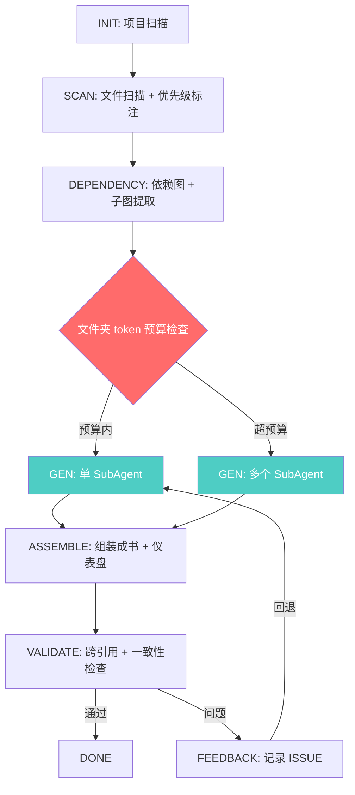
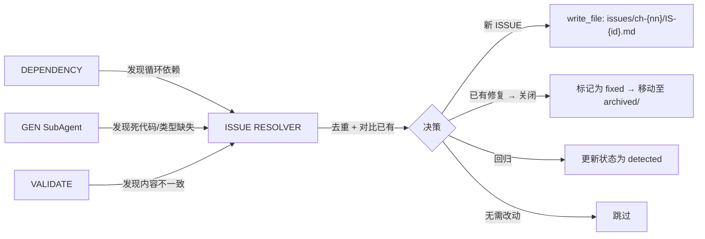

# AgenticWiki v2 — Context-Safe Pipeline 技术规格

> **版本**: v2.0-draft  
> **状态**: SPEC  
> **日期**: 2026-05-29  
> **基于**: 三轮脑暴（局部诊断 + 发散方案 + 用户思路融合）

---

## 目录

1. [问题定义](#一问题定义)
2. [核心架构原则](#二核心架构原则)
3. [脚本 vs LLM 边界规范](#三脚本-vs-llm-边界规范)
4. [流水线重新设计](#四流水线重新设计)
5. [文件优先级体系](#五文件优先级体系)
6. [文件夹拆分策略](#六文件夹拆分策略)
7. [Wiki 成书化规范](#七wiki-成书化规范)
8. [Issue Wiki 体系](#八issue-wiki-体系)
9. [SubAgent 模板规范](#九subagent-模板规范)
10. [编排器状态机](#十编排器状态机)
11. [新增脚本规格](#十一新增脚本规格)
12. [路径解析规范](#十二路径解析规范)
13. [资源优化清单](#十三资源优化清单)
14. [从 v1 迁移路径](#十四从-v1-迁移路径)

---

## 一、问题定义

### 1.1 v1 的上下文溢出缺陷

在 `500+` 文件的项目中，当前流水线存在以下关键缺陷：

| Bug ID | 描述 | 严重性 | 根因 |
|--------|------|--------|------|
| **B1** | 分析 JSON 包含 LLM 生成的无界叙述文本 | 🔴 Critical | LLM 在 JSON 字段中写入自然语言描述 |
| **B2** | SubAgent 读取文件夹中的**所有**文件 | 🔴 Critical | 无文件数量或上下文大小限制 |
| **B3** | 编排器"读取全部 → 转发"的模式 | 🔴 Critical | 在阶段间以完整 JSON 块传递数据 |
| **B4** | 依赖图 JSON 包含所有模块 | 🟠 High | 无分页或子图提取 |
| **B5** | 阶段之间无摘要/截断 | 🟠 High | 缺少分层数据访问模式 |
| **B6** | Phase 0 在分析前读取全部项目文档 | 🟡 Medium | 上下文在启动时即被文档塞满 |
| **B7** | 验证阶段读取全部 Wiki + 全部源代码 | 🟡 Medium | 完整的全量重新读取 |
| **B8** | 完整的项目上下文被传递给每个 SubAgent | 🟡 Medium | 上下文在并发 Agent 之间被重复 |
| **B9** | 三种基准路径混在一起：AgenticWiki 根目录、目标项目根目录、SubAgent 工作目录 | 🔴 Critical | 没有统一的路径解析层，每个 Agent/Script 靠猜测 cwd |
| **B10** | SubAgent 启动时没有显式的 `basePath` 参数 | 🔴 Critical | `spawn_agent` 不传递项目路径，SubAgent 无法正确解析相对路径 |
| **B11** | 脚本路径和目标项目路径在同一个 `terminal` 调用中混用 | 🟠 High | `npx tsx src/lib/scan-files.ts --path src/` 中的两个路径分属不同基准 |
| **B12** | `state.json.config.sourcePath` 是相对路径，无显式 basePath 引用 | 🟡 Medium | 任何下游消费者需要猜测解析基准 |
| **B13** | ANALYZE + GENERATE 双重读取源文件 | 🔴 Critical | 83 个文件被完整读取 2 次（一次分析，一次生成 Wiki） |
| **B14** | 测试文件（`*.test.ts`、`*.spec.ts`）未被过滤 | 🟠 High | 30 个测试文件流入分析阶段，消耗上下文 |
| **B15** | 过多的小粒度 SubAgent 调用 | 🟠 High | 19 个 SubAgent × ~30s 启动开销 ≈ 9.5 分钟的纯调度时间 |
| **B16** | 多个 SubAgent 独立重新分析相同架构（交叉重复） | 🟡 Medium | 如 4 个 Wiki 页面重复描述相同的安全架构 |
| **B17** | 小文件夹（< 5 个文件）的 SubAgent 开销超过分析收益 | 🟡 Medium | 启动 Agent 的开销 > 读取和分析 4 个文件的开销 |

### 1.2 上下文安全风险评估（5000 文件项目）

| 产物 | 估算大小 | 上下文状态 |
|------|---------|-------------|
| `file-list.json` | ~200KB | ✅ 可管理 |
| `dependency-graph.json`（完整） | ~5-10MB | ❌ 无法装入 SubAgent 上下文 |
| `analysis/{folder}.json` × 100 | ~5-15MB 总计 | ❌ 读取单个文件都可能溢出 |
| SubAgent 提示 + 代码文件 | 每个文件夹无界 | ❌ 50+ 文件的文件夹会立即溢出 |
| 编排器汇总读取 | ~10-25MB | ❌ 单次 `read_file` 操作完全不可能 |

### 1.3 Encrypted-Bookmark 实战分析（v1 流水线）

通过对真实项目 Encrypted-Bookmark（141 个文件）运行完整 v1 流水线后，确认了以下实测数据：

| 指标 | 值 | 问题 |
|------|-----|------|
| 总 SubAgent 调用 | 19 次（9 ANALYZE + 10 GENERATE） | B15：调度开销过高 |
| 总耗时 | ~21 分钟 | B13、B15 是主要耗时来源 |
| 源文件读取次数 | 83 个文件 × 2 次 = 166 次 | B13：双重读取 |
| 测试文件泄漏 | 30 个 `.test.ts` 未被过滤 | B14：测试文件流入分析 |
| 安全架构重复 | 4 个 Wiki 页面重复描述相同的 9 层防御 | B16：交叉重复 |
| Wiki 产出 | 10 页，3,398 行 | 质量良好但效率低下 |

**根因**：ANALYZE 和 GENERATE 是两个独立阶段，各自读取完整文件集。CSS 被过滤，但测试文件没有。每个文件夹独立分析，无法共享上下文。

### 1.4 Bug 覆盖矩阵（v1 Bug → v2 SPEC 覆盖情况）

| Bug ID | SPEC v2 覆盖情况 | 对应章节 |
|--------|:---:|------|
| B1 | ✅ 合并 ANALYZE+GENERATE，LLM 不写 JSON | §4 |
| B2 | ✅ 优先级标注 P0-P4，SubAgent 按预算读取 | §5 |
| B3 | ✅ 编排器仅传递文件路径，不转发数据 | §2.2 |
| B4 | ✅ 子图提取 `{folder}-deps.json` | §11.2 |
| B5 | ✅ 分层摘要 + 按需深入 | §6 |
| B6 | ✅ 移除 Phase 0 的文档全量预读 | §4 |
| B7 | ✅ 验证仅对比 frontmatter 引用 + 符号索引 | §4.2 |
| B8 | ✅ 仅传递文件路径 + 子图，不传递完整上下文 | §9 |
| B9 | 🆕 三层路径分类 + 显式 basePath | §12 |
| B10 | 🆕 SubAgent 模板含 `项目根目录` 声明 | §9、§12 |
| B11 | 🆕 `terminal` 调用规范：目标项目 = cwd | §12.3 |
| B12 | 🆕 `state.json.config.paths` 新增绝对路径字段 | §10、§12 |
| B13 | ✅ 合并 ANALYZE+GENERATE | §4.3 |
| B14 | ✅ P3 级跳过测试文件 | §5.1 |
| B15 | ✅ 跨文件夹合并 + 最小 token 阈值 | §6.2 |
| B16 | ✅ ASSEMBLE 阶段统一生成交叉引用 | §4.2 |
| B17 | ✅ 5K token 最小阈值 + `crossFolderMerges` | §6.2、§6.3 |

---

## 二、核心架构原则

### 2.1 边界原则

```
┌──────────────────────────────────────────────────┐
│              脚本（确定性的，通过 tsx 运行）        │
│                                                    │
│  仅生成结构化 JSON：                                │
│  • 文件列表、统计数据                               │
│  • 依赖图、循环依赖                                 │
│  • 优先级标注、token 估算                           │
│  • 符号索引、仪表盘聚合                              │
│  • 永远不生成叙述性文本                              │
│  • JSON 大小始终可预测（无 LLM 生成的内容）           │
└──────────────────────────────────────────────────┘

┌──────────────────────────────────────────────────┐
│              LLM（SubAgent，通过 spawn_agent 运行） │
│                                                    │
│  仅生成 Markdown：                                  │
│  • 带有叙述性描述的 Wiki 章节                        │
│  • 带有人类可读上下文的 Issue Markdown               │
│  • 永远不写入 JSON 文件                              │
│  • 读取脚本生成的 JSON 元数据，但不修改它们           │
└──────────────────────────────────────────────────┘
```

**黄金法则**：脚本写 JSON，LLM 写 Markdown。两者永远不在同一个文件中混合。

### 2.2 传递策略

| 旧版（v1） | 新版（v2） |
|-----------|-----------|
| 编排器读取全部 JSON → 内联到 SubAgent 提示 | 编排器传递**文件路径** → SubAgent 自行按需读取 |
| 完整的依赖图 → 每个 Agent | 每个 Agent 的**子图**（仅直接邻接） |
| 完整的代码文件 → SubAgent | 带**优先级标注**的文件清单 → SubAgent 在**预算内**决定读取内容 |
| 编排器 → 数据总线 | 编排器 → **任务路由器** |

### 2.3 纵深防御

三层防护确保上下文安全：

```
第 1 层：文件夹拆分（粗粒度）
  → 按文件角色/类型 + token 预算拆分文件夹，防止单个子任务过大

第 2 层：文件优先级标注（细粒度）
  → SubAgent 获得 P0-P4 文件清单，按预算自主决策读取范围

第 3 层：调度前上下文预算检查（门控）
  → 编排器在派发 SubAgent 前，估算 token 消耗，超过阈值即拆分
```

---

## 三、脚本 vs LLM 边界规范

### 3.1 产物所有权矩阵

| 产物 | 写入者 | 读取者 | 格式 | 包含叙述性文本？ |
|------|--------|--------|------|:---:|
| `state.json` | 编排器 | 编排器 | JSON | ❌ |
| `project-scan.json` | `scan-project.ts` | 编排器、SubAgent | JSON | ❌ |
| `file-list.json` | `scan-files.ts` | 编排器、脚本 | JSON | ❌ |
| `file-priorities.json` | `file-priorities.ts` | SubAgent | JSON | ❌ |
| `folder-strategy.json` | `analyze-folders.ts` | 编排器 | JSON | ❌ |
| `dependency-graph.json` | `build-deps.ts` | 编排器、脚本 | JSON | ❌ |
| `{folder}-deps.json` | `extract-subgraph.ts` | SubAgent | JSON | ❌ |
| `symbol-index.json` | `symbol-index.ts` | 工具、编排器 | JSON | ❌ |
| `wiki/**/*.md` | LLM SubAgent | 人类、编排器 | Markdown | ✅ |
| `issues/**/*.md` | LLM SubAgent | 人类、编排器 | Markdown | ✅ |
| `book.md`、`_toc.md` | 编排器 / LLM | 人类 | Markdown | ✅ |
| `issue-dashboard.md` | `issue-dashboard.ts` | 人类 | Markdown | ❌ |
| `feedback/prompts.md` | 编排器 | 编排器、SubAgent | Markdown | ✅ |

### 3.2 脚本设计约束

- 所有脚本必须为**纯函数**：相同的输入 → 相同的输出
- 运行时间 ≤ 30 秒（文件系统扫描）
- 输出 JSON 大小 ≤ 5MB（即使对于超大型项目）
- 不允许依赖 LLM、不允许 `fetch`、不允许网络调用
- 通过 `npx tsx src/lib/<script>.ts --input ... --output ...` 调用

### 3.3 LLM（SubAgent）设计约束

- **写入**：仅 `.md` 文件（Wiki 章节 + Issue 文件）
- **读取**：脚本生成的 JSON（元数据）+ 源代码文件（按优先级）
- **不生成**：JSON 文件、中间分析产物
- **不修改**：脚本生成的 JSON（只读）
- **不直接编辑**：其他 SubAgent 的 Markdown 文件（通过编排器协调）

---

## 四、流水线重新设计

### 4.1 v2 DAG 拓扑



**关键变更**：
- `ANALYZE` + `GENERATE` → 合并为单一的 `GEN` 阶段（无中间产物 JSON）
- 新增 `ASSEMBLE` 阶段（组装成书 + 术语表 + 仪表盘）
- `ISSUE` 现在分布在各阶段发现，在 ASSEMBLE 阶段统一汇总
- `FEEDBACK` 触发时有选择地回退到 GEN（而非整条流水线）

### 4.2 阶段详情

| 阶段 | 技能 | 执行者 | 输入 | 输出 |
|------|------|--------|------|------|
| **INIT** | `aw-init` | Main Agent + 脚本 | 项目根目录 | `project-scan.json`、`state.json` |
| **SCAN** | `aw-scan` | Main Agent + 脚本 | `project-scan.json` | `file-list.json`、`folder-strategy.json`、`file-priorities.json` |
| **DEPENDENCY** | `aw-dependency` | Main Agent + 脚本 | `file-list.json` | `dependency-graph.json`、`{folder}-deps.json` |
| **GEN** | `aw-generate` | **SubAgent 并发** | P0-P4 文件清单 + 子图 + 模板 | Wiki 章节 `.md` + Issue `.md` |
| **ASSEMBLE** | `aw-generate` | Main Agent + 脚本 | 全部 `.md` 文件 | `book.md`、`_toc.md`、`glossary.md`、`issue-dashboard.md`、`symbol-index.json` |
| **VALIDATE** | `aw-validate` | Main Agent + 脚本 | 全部 `.md` + `symbol-index.json` | `validation-report.json` |
| **FEEDBACK** | `aw-feedback` | Main Agent | `validation-report.json` | `feedback/prompts.md` + 回退决策 |

### 4.3 GEN 阶段：合并分析 + 生成

这是最重要的架构变更。GEN SubAgent 接收：

```
输入（由编排器作为文件路径传递）：
  1. .agentic-wiki/cache/file-priorities.json   ← P0-P4 文件清单 + token 估算
  2. .agentic-wiki/cache/deps/{folder}-deps.json ← 该文件夹的依赖子图
  3. wiki 章节模板                                ← 结构化输出格式
  4. token 预算                                    ← 最大值（例如，80K tokens）

SubAgent 自主执行的步骤：
  a) 读取 P0 文件（入口点、桶文件）— 始终读取
  b) 在预算允许的情况下读取 P1 文件（核心逻辑）
  c) 仅在 P0/P1 引用时读取 P2 文件（按需）
  d) 跳过 P3/P4 文件
  e) 直接输出 Wiki 章节内容（无中间 JSON）
  f) 如果发现问题，直接输出 Issue Markdown

输出（由 SubAgent 直接写入）：
  wiki/volume-{n}-{scope}/ch-{nn}/sec-{name}.md   ← Wiki 章节
  wiki/volume-2-issues/ch-{nn}/IS-{id}.md         ← Issue（如有）
```

**已消除**：`analysis/{folder}.json` — 不再生成。不再有 LLM 写入 JSON。

---

## 五、文件优先级体系

### 5.1 优先级层级

| 优先级 | 标签 | 文件类型 | 规则 | 默认操作 |
|--------|------|---------|------|---------|
| **P0** | 入口/桶 | `index.ts`、`App.tsx`、`main.tsx`、桶导出文件 | 命名模式匹配 | 始终读取 |
| **P1** | 核心逻辑 | React 组件、页面、自定义 Hook、状态管理、路由 | 由 `file-priorities.ts` 启发式判定 | 预算允许时读取 |
| **P2** | 支撑 | 工具函数、常量、类型定义、辅助类 | 由 `file-priorities.ts` 启发式判定 | 仅在 P0/P1 引用时读取 |
| **P3** | 低优先级 | 测试（`*.test.ts`、`*.spec.ts`）、Story（`*.stories.tsx`）、配置文件 | 命名模式 + 路径 | 跳过（GEN 阶段不读取） |
| **P4** | 已过滤 | 纯样式文件（`*.css`、`*.scss`）、生成的文件 | 扩展名 + AST 检测 | 永远跳过 |

### 5.2 P0/P1 启发式判定（`file-priorities.ts`）

```typescript
function assignPriority(file: string, deps: DependencyGraph): Priority {
  // P0: 入口文件命名模式
  if (isEntryName(file)) return 'P0';
  
  // P0: 高被依赖（≥ 10 个依赖方）
  if (deps.getDependentCount(file) >= 10) return 'P0';
  
  // P1: 包含 JSX / React 组件 / Hook
  if (containsJSX(file) || containsHook(file)) return 'P1';
  
  // P1: 高被依赖（5-9 个依赖方）
  if (deps.getDependentCount(file) >= 5) return 'P1';
  
  // P3: 测试文件
  if (isTestFile(file)) return 'P3';
  
  // P3: Story 文件
  if (isStoryFile(file)) return 'P3';
  
  // P4: 纯样式
  if (isStyleFile(file)) return 'P4';
  
  // P2: 默认
  return 'P2';
}
```

### 5.3 Token 估算模型

```typescript
interface TokenEstimate {
  path: string;
  priority: Priority;
  lineCount: number;       // 通过 wc -l 获取
  estimatedTokens: number; // lineCount * 1.5（经验系数：TypeScript 注释 + JSX）
  dependentCount: number;  // 来自依赖图
}
```

### 5.4 `file-priorities.json` 输出格式

```json
{
  "generatedAt": "2026-05-29T10:02:00Z",
  "folders": {
    "src/components/": {
      "totalTokens": 45000,
      "files": [
        {
          "path": "src/components/index.ts",
          "priority": "P0",
          "lineCount": 15,
          "estimatedTokens": 22,
          "dependentCount": 25,
          "reason": "入口文件（命名：index） + 高被依赖（25）"
        },
        {
          "path": "src/components/Button.tsx",
          "priority": "P1",
          "lineCount": 120,
          "estimatedTokens": 180,
          "dependentCount": 8,
          "reason": "包含 JSX 组件"
        },
        {
          "path": "src/components/Button.test.tsx",
          "priority": "P3",
          "lineCount": 200,
          "estimatedTokens": 300,
          "dependentCount": 0,
          "reason": "测试文件"
        },
        {
          "path": "src/components/styles.css",
          "priority": "P4",
          "lineCount": 500,
          "estimatedTokens": 750,
          "dependentCount": 0,
          "reason": "纯样式文件"
        }
      ]
    }
  }
}
```

---

## 六、文件夹拆分策略

### 6.1 三级拆分算法

```
第 1 级：文件数量检查
  → 如果 fileCount > 50，标记 shouldSplit

第 2 级：语义角色分组
  → 将文件分组：入口文件 | UI 组件 | 业务组件 | Hooks | 工具函数 | 类型

第 3 级：Token 预算门控
  → 如果 group.estimatedTokens > 50K，进一步拆分 group
  → 如果 group.estimatedTokens < 5K，与相邻 group 合并
```

### 6.2 拆分粒度控制

| 条件 | 操作 |
|------|------|
| 组 tokens > 50K | 拆分为多个子任务（例如，`ui-components-1`、`ui-components-2`） |
| 组 tokens < 5K | 与相邻组合并为复合子任务 |
| 文件夹 tokens 总计 < 30K | 不拆分 — 单个 SubAgent 处理全部 |
| 文件夹 tokens 总计 > 30K | 按角色分组拆分 |

### 6.3 `folder-strategy.json` 增强

```json
{
  "generatedAt": "2026-05-29T10:03:00Z",
  "folders": [
    {
      "path": "src/components/",
      "totalFiles": 120,
      "totalTokens": 65000,
      "shouldSplit": true,
      "subTasks": [
        {
          "id": "src-components-entry",
          "label": "入口 + 类型",
          "role": "entry",
          "files": ["src/components/index.ts"],
          "estimatedTokens": 200,
          "priority": "P0"
        },
        {
          "id": "src-components-ui",
          "label": "UI 组件",
          "role": "ui-components",
          "files": ["Button.tsx", "Input.tsx", "Modal.tsx", "..."],
          "estimatedTokens": 28000,
          "wikiChapter": "ch-02-core/sec-components.md",
          "priority": "P1"
        },
        {
          "id": "src-components-hooks",
          "label": "自定义 Hooks",
          "role": "hooks",
          "files": ["useForm.ts", "useDebounce.ts"],
          "estimatedTokens": 3500,
          "mergeWith": "src-hooks/",
          "priority": "P1"
        }
      ]
    }
  ],
  "crossFolderMerges": [
    {
      "id": "all-hooks",
      "label": "全局 Hooks 汇总",
      "folders": ["src/components/", "src/hooks/", "src/pages/"],
      "files": ["useForm.ts", "useDebounce.ts", "useAuth.ts"],
      "estimatedTokens": 12000,
      "wikiChapter": "ch-03-hooks/index.md",
      "priority": "P1"
    }
  ]
}
```

---

## 七、Wiki 成书化规范

### 7.1 四层书结构

```
wiki/                                    # 📚 项目知识库
│
├── book.md                              # 封面 + 总目录
│
├── volume-1-code/                       # 卷 I：代码 Wiki
│   ├── _toc.md                          #   本卷目录
│   ├── ch-01-architecture.md            #   第一章：架构总览（单页）
│   ├── ch-02-core/                      #   第二章：核心模块
│   │   ├── index.md                     #     章概述 + 依赖图
│   │   ├── sec-components.md            #     第一节：组件体系
│   │   ├── sec-hooks.md                 #     第二节：Hooks 体系
│   │   └── sec-utils.md                 #     第三节：工具函数
│   ├── ch-03-pages/                     #   第三章：页面体系
│   │   ├── index.md
│   │   ├── sec-dashboard.md
│   │   └── sec-settings.md
│   └── ch-04-services/                  #   第四章：服务层
│       ├── index.md
│       └── sec-api.md
│
├── volume-2-issues/                     # 卷 II：ISSUE Wiki（独立！）
│   ├── _toc.md                          #   ISSUE 总目录 + 索引缓存
│   ├── ch-01-circular-deps/             #   第一章：循环依赖
│   │   ├── index.md
│   │   ├── IS-001.md
│   │   └── IS-003.md
│   ├── ch-02-dead-code/                 #   第二章：死代码
│   ├── ch-03-missing-types/             #   第三章：类型缺失
│   ├── ch-04-complex-logic/             #   第四章：复杂逻辑
│   ├── ch-05-validation/                #   第五章：验证问题
│   └── ch-99-archived/                  #   终章：已归档（历史墓地）
│       ├── index.md
│       └── IS-002.md
│
├── appendix/                            # 附录
│   ├── issue-dashboard.md               #   ISSUE 仪表盘（脚本生成）
│   ├── api-reference.md                 #   API 签名速查
│   ├── type-index.md                    #   类型定义索引
│   └── dependency-map.md                #   全局依赖关系图（Mermaid）
│
├── glossary.md                          # 术语表
└── search-index.json                    # 搜索索引（脚本生成）
```

### 7.2 章/节模板

#### `_toc.md`（卷级目录）

```markdown
# 卷 I：代码 Wiki

> 本卷涵盖项目核心代码架构，从架构总览到具体模块实现。
> 建议依次阅读，也可通过目录跳转至关注章节。

| 章 | 标题 | 源文件夹 | 文件数 |
|----|------|---------|--------|
| [[ch-01-architecture]] | 架构总览 | `src/` | 12 |
| [[ch-02-core/index]] | 核心模块 | `src/core/` | 45 |
| → [[ch-02-core/sec-components]] | 组件体系 | `src/components/` | 30 |
| → [[ch-02-core/sec-hooks]] | Hooks 体系 | `src/hooks/` | 15 |
| [[ch-03-pages/index]] | 页面体系 | `src/pages/` | 8 |

## 快速导航

- 🔴 存在问题的模块：[[ch-02-core/sec-components]]（2 个 ISSUE）
- 🟢 无已知问题的模块：[[ch-03-pages/index]]
```

#### 章 `index.md`（章概述）

```markdown
---
tags: [core, overview]
lastUpdated: 2026-05-29
sourceFiles: [src/core/index.ts]
---

# 第二章：核心模块

## 概述

核心模块提供了项目的基础组件、Hooks 和工具函数。
所有页面和业务模块依赖此层。

## 本章包含

- [[ch-02-core/sec-components]] — 通用 UI 组件库（Button、Input、Modal 等）
- [[ch-02-core/sec-hooks]] — 自定义 Hooks（useAuth、useForm 等）
- [[ch-02-core/sec-utils]] — 工具函数（formatDate、debounce 等）

## 依赖关系

[来自 {folder}-deps.json 的 Mermaid 图]

## 已知问题

| ISSUE | 严重性 | 状态 |
|-------|--------|------|
| [[../volume-2-issues/ch-01/IS-001]] | 🔴 High | 🔍 detected |
```

#### 节 `.md`（内容页 — 由 GEN SubAgent 生成）

```markdown
---
tags: [components, ui, react]
lastUpdated: 2026-05-29
sourceFiles:
  - src/components/Button.tsx
  - src/components/Input.tsx
  - src/components/Modal.tsx
---

# 第一节：组件体系

## 概述

通用 UI 组件库，包含 Button、Input、Modal 三个组件，用于构建用户界面。

## 组件列表

| 名称 | 类型 | Props 数量 | 用途 |
|------|------|-----------|------|
| Button | 函数组件 | 3 | 通用按钮，支持 primary / secondary 变体 |
| Input | 函数组件 | 5 | 受控输入框，支持验证状态 |
| Modal | 函数组件 | 4 | 模态对话框，支持自定义内容 |

### Button

**签名**：
```typescript
function Button(props: { label: string; onClick: () => void; variant?: 'primary' | 'secondary' }): JSX.Element
```

**用途**：通用按钮组件。`variant` 默认值为 `'primary'`。

**状态管理**：无内部状态。完全受控于 props。

**依赖**：`react`

### Input

[类似结构...]

### Modal

[类似结构...]

## 依赖关系

[来自 {folder}-deps.json 的 Mermaid 图]

## 数据流

- **入**：通过 props 从父组件接收配置
- **出**：通过 onClick / onChange 回调向父组件传递事件
- **内**：Input 内部使用 useState 管理 focus 状态

## 相关章节

- [[../ch-03-pages/index]] — 页面体系（使用了 Button 和 Input）

## 已知问题

| ISSUE | 严重性 | 状态 |
|-------|--------|------|
| [[../../volume-2-issues/ch-01/IS-001]] | 🔴 High | detected — Input 存在循环依赖 |
```

### 7.3 `book.md`（封面 + 总目录 — 由 ASSEMBLE 阶段生成）

```markdown
# {项目名称}

> 自动生成的项目知识库  
> 生成时间：2026-05-29  
> 技术栈：React + TypeScript + Vite  
> 源码路径：`src/`

---

## 总目录

### 卷 I：代码 Wiki

| 章 | 说明 |
|----|------|
| [[volume-1-code/ch-01-architecture]] | 架构总览 |
| [[volume-1-code/ch-02-core/index]] | 核心模块 |
| [[volume-1-code/ch-03-pages/index]] | 页面体系 |

### 卷 II：ISSUE Wiki

| 章 | 说明 | 待处理 |
|----|------|--------|
| [[volume-2-issues/ch-01-circular-deps/index]] | 循环依赖 | 2 个 |
| [[volume-2-issues/ch-02-dead-code/index]] | 死代码 | 0 个 |

### 附录

| 文档 | 说明 |
|------|------|
| [[appendix/issue-dashboard]] | ISSUE 仪表盘 |
| [[appendix/api-reference]] | API 签名速查 |
| [[glossary]] | 术语表 |

---

## 项目健康度

| 指标 | 值 |
|------|-----|
| 模块总数 | 103 |
| 组件总数 | 45 |
| 🔴 未解决的高严重性 ISSUE | 3 |
| 🟡 未解决的中等严重性 ISSUE | 12 |
| 📦 已归档 ISSUE | 8 |

> [[appendix/issue-dashboard]] — 完整仪表盘
```

### 7.4 `glossary.md`（术语表 — 由 ASSEMBLE 阶段从符号索引生成）

```markdown
# 术语表

## 类型

| 术语 | 定义 | 定义位置 | 详情 |
|------|------|---------|------|
| `UserProfile` | 用户信息数据模型 | `src/types/user.ts` | [[volume-1-code/ch-02-core/sec-types]] |
| `ApiResponse<T>` | 通用 API 响应包装 | `src/types/api.ts` | [[volume-1-code/ch-04-services/sec-api]] |

## 接口

| 术语 | 定义 | 定义位置 | 详情 |
|------|------|---------|------|
| `IAuthService` | 认证服务接口 | `src/services/auth.ts` | [[volume-1-code/ch-04-services/sec-api]] |

## 枚举

| 术语 | 定义 | 定义位置 | 详情 |
|------|------|---------|------|
| `UserRole` | 用户角色枚举 | `src/types/user.ts` | [[volume-1-code/ch-02-core/sec-types]] |

## 常量

| 术语 | 值 | 定义位置 | 详情 |
|------|-----|---------|------|
| `MAX_RETRY_COUNT` | `3` | `src/constants/api.ts` | [[volume-1-code/ch-04-services/sec-api]] |
```

---

## 八、ISSUE Wiki 体系

### 8.1 设计原则

- ISSUE Wiki 是独立的卷（`volume-2-issues/`），与代码 Wiki 完全解耦
- 每个 ISSUE 是一个独立的 `.md` 文件，带 YAML frontmatter 提供结构化元数据
- 双向链接将 ISSUE 连接到代码 Wiki 章节
- 一个独立的 ISSUE 仪表盘聚合所有统计信息
- ISSUE 生命周期：`detected → verified → fixing → fixed → archived`（或 `false_positive`）

### 8.2 Issue Markdown 模板

```markdown
---
id: IS-2026-001
type: circular_dependency
severity: high
confidence: high
status: detected
detected_at: 2026-05-29T10:05:00Z
detected_by: aw-dependency
source_files:
  - src/utils/cache.ts
  - src/utils/logger.ts
related_wiki:
  - "[[../../volume-1-code/ch-02-core/sec-utils]]"
  - "[[../../volume-1-code/ch-04-services/sec-api]]"
history:
  - at: 2026-05-29T10:05:00Z
    event: detected
    by: aw-dependency
    note: "循环依赖：cache.ts → logger.ts → cache.ts"
tags: [circular-dependency, utils, high-priority]
---

# IS-2026-001：循环依赖 — cache.ts ↔ logger.ts

## 概述

`src/utils/cache.ts` 和 `src/utils/logger.ts` 之间存在循环依赖。

## 依赖链

```
cache.ts → logger.ts (import { log } from './logger')
logger.ts → cache.ts (import { getCache } from './cache')
```

## 影响范围

| 指标 | 值 |
|------|-----|
| 依赖 cache.ts 的模块 | 15 |
| 依赖 logger.ts 的模块 | 23 |
| 风险 | 模块初始化顺序不确定，可能导致运行时的 `undefined` 错误 |

## 建议方案

1. **提取共享接口**：将共享接口提取到 `src/utils/types.ts`
2. **依赖注入**：使用依赖注入解耦两个模块
3. **合并模块**：合并两个模块为一个 `src/utils/cache-with-log.ts`

## 相关 ISSUE

- [[IS-2026-003]] — 同一模块中的循环依赖（cache.ts → metrics.ts）

## 相关 Wiki

- [[../../volume-1-code/ch-02-core/sec-utils]] — 工具函数模块
- [[../../volume-1-code/ch-04-services/sec-api]] — API 服务层（依赖 cache.ts）

## 状态时间线

| 时间 | 事件 | 操作者 | 备注 |
|------|------|--------|------|
| 2026-05-29T10:05 | 🔍 发现 | aw-dependency | 自动检测到循环依赖 |
| 2026-05-30T14:00 | ✅ 确认 | manual | 人工确认问题存在 |
```

### 8.3 ISSUE 发现 → 入库流程



**ISSUE RESOLVER** 在 ASSEMBLE 阶段作为编排器逻辑运行：

1. 扫描任意阶段发现的所有 ISSUE
2. 按 id + source_files + type 去重
3. 对比 `volume-2-issues/` 中已有的 ISSUE
4. 新增 / 更新状态 / 移至归档 / 跳过

### 8.4 `issue-dashboard.md`（由 `issue-dashboard.ts` 脚本生成）

```markdown
# ISSUE 仪表盘

> 最后更新：2026-05-29T11:00:00Z

## 概览

| 状态 | 数量 |
|------|------|
| 🔍 detected | 12 |
| ✅ verified | 5 |
| 🔧 fixing | 3 |
| ✅ fixed | 20 |
| ❌ false_positive | 2 |
| 📦 archived | 8 |
| **合计** | **50** |

## 严重等级分布


## 按类型分布

| 类型 | 数量 | 待处理 |
|------|------|--------|
| circular_dependency | 5 | 3 |
| dead_code | 12 | 8 |
| missing_types | 20 | 6 |
| complex_logic | 8 | 4 |
| validation | 5 | 1 |

## 🔴 待处理 — 高严重性

| ID | 类型 | 文件 | 发现日期 |
|----|------|------|---------|
| [[volume-2-issues/ch-01/IS-001]] | 循环依赖 | cache.ts, logger.ts | 2026-05-29 |
| [[volume-2-issues/ch-01/IS-005]] | 循环依赖 | auth.ts, api.ts | 2026-05-28 |
| [[volume-2-issues/ch-02/IS-012]] | 死代码 | legacy/old-api.ts | 2026-05-27 |

## 🟡 待处理 — 中等严重性

| ID | 类型 | 文件 | 发现日期 |
|----|------|------|---------|
| [[volume-2-issues/ch-03/IS-020]] | 类型缺失 | utils/helper.ts | 2026-05-29 |
| ... | ... | ... | ... |
```

### 8.5 ISSUE 状态机

```
                    ┌─────────┐
                    │ detected │ ← ISSUE 在此创建
                    └────┬────┘
                         │ 人工审核
                    ┌────▼────┐
                    │ verified │
                    └────┬────┘
                         │ 开发者开始处理
                    ┌────▼────┐
                    │ fixing  │
                    └────┬────┘
                         │
              ┌──────────┼──────────┐
              │          │          │
         ┌────▼───┐ ┌───▼────┐ ┌──▼──────────┐
         │ fixed  │ │regress │ │false_positive│ ← 无需代码修改
         └────┬───┘ └───┬────┘ └──────┬───────┘
              │         │             │
              │         └──→ detected │
              │                      │
         ┌────▼───┐                  │
         │archived│ ←───────────────┘
         └────────┘   VALIDATE 确认 fixed 后自动归档
```

---

## 九、SubAgent 模板规范

### 9.1 GEN SubAgent 提示模板

```
你是 AgenticWiki GEN SubAgent。

## 上下文

  项目根目录：{projectRoot}（绝对路径）
    所有相对路径均以此目录为基准解析。
    读取源文件时使用绝对路径：{projectRoot}/{relativeFilePath}
  
  优先级文件：.agentic-wiki/cache/file-priorities.json
    完整路径：{projectRoot}/.agentic-wiki/cache/file-priorities.json
  
  依赖子图：.agentic-wiki/cache/deps/{folder}-deps.json
    完整路径：{projectRoot}/.agentic-wiki/cache/deps/{folder}-deps.json
  
  输出位置：wiki/volume-1-code/ch-{nn}/sec-{name}.md
    完整路径：{projectRoot}/wiki/volume-1-code/ch-{nn}/sec-{name}.md
  
  Token 预算：{budget} tokens

## 你的任务

为文件夹 "{folderPath}" 生成 Wiki 章节。不要创建任何中间 JSON 文件。

### 步骤 0：解析路径

所有源文件路径相对于项目根目录：`{projectRoot}`
读取文件时始终拼接为绝对路径：`{projectRoot}/{relativePath}`
写入文件时同样使用绝对路径。

### 步骤 1：按优先级读取文件

1. 读取 .agentic-wiki/cache/file-priorities.json（使用上述完整路径），找到 "{folderPath}" 条目
2. 读取所有 P0 文件（始终）
3. 按 token 预算允许读取 P1 文件
4. 仅在 P0/P1 的导入语句引用时读取 P2 文件
5. 跳过 P3 和 P4 文件
6. 记录实际读取的文件清单

### 步骤 2：生成 Wiki 章节

使用 write_file 将输出写入：{outputPath}

必需章节：
  - YAML frontmatter（tags、lastUpdated、sourceFiles）
  - ## 概述（1-2 段）
  - ## 组件/函数列表（表格）
  - ## 每个组件的详细说明（签名、props、用途、状态、依赖）
  - ## 依赖关系（来自子图 JSON 的 Mermaid 图）
  - ## 数据流（入/出/内）
  - ## 相关章节（Obsidian wiki 链接格式）
  - ## 已知问题（交叉引用 ISSUE Wiki）

### 步骤 3：发现问题时创建 ISSUE

如果遇到以下情况，创建一个独立的 ISSUE Markdown 文件：
  - 循环依赖（来自依赖子图中标记为 circular: true 的依赖）
  - 明显的死代码（未被导入的已导出符号）
  - 缺失的类型标注（any 类型的 Props）
  - 过于复杂的逻辑（嵌套深度 > 4 或行数 > 200）

ISSUE 格式：遵循模板（见 Section 8.2）。
输出位置：wiki/volume-2-issues/ch-{nn}/IS-{id}.md

### 步骤 4：报告

输出一个简短的摘要报告，内容为：
  - 读取了哪些文件（按优先级）
  - 遇到了哪些问题（ISSUE 文件路径）
  - 预估 token 使用量 vs. 预算

## 重要注意事项

- 不要写入任何 JSON 文件
- 不要生成中间分析产物
- Obsidian 链接格式：[[../../volume-1-code/ch-nn/sec-name]]
- Mermaid 图应简洁（≤ 20 个节点）
- 所有表格应格式良好且对齐
```

### 9.2 SubAgent 配置

```
spawn_agent 参数：
  agent_type: "general-purpose"
  max_turns: 50
  context_budget: {来自文件夹策略的 estimatedTokens * 2}（为提示开销预留 2 倍安全系数）
```

**必须注入的变量**（编排器在构建提示时替换）：

| 变量 | 来源 | 示例值 |
|------|------|--------|
| `{projectRoot}` | `state.json.config.paths.projectRoot` | `/path/to/target/project` |
| `{folderPath}` | `folder-strategy.json` 中的子任务 | `src/components/` |
| `{budget}` | `state.json.config.tokenBudgetPerSubTask` | `80000` |
| `{outputPath}` | `folder-strategy.json` 中的 `wikiChapter` | `wiki/volume-1-code/ch-02-core/sec-components.md` |

**注意**：`{outputPath}` 是相对路径，SubAgent 应以 `{projectRoot}/{outputPath}` 解析。

---

## 十、编排器状态机

### 10.1 `state.json` 增强

```json
{
  "id": "20260529-my-project",
  "projectPath": "/path/to/project",
  "createdAt": "2026-05-29T10:00:00Z",
  "currentPhase": "GEN",
  "phaseHistory": [
    {
      "phase": "INIT",
      "status": "completed",
      "startedAt": "...",
      "completedAt": "...",
      "output": ".agentic-wiki/cache/project-scan.json"
    },
    {
      "phase": "SCAN",
      "status": "completed",
      "startedAt": "...",
      "completedAt": "...",
      "output": ".agentic-wiki/cache/folder-strategy.json"
    }
  ],
  "genTasks": [
    {
      "id": "src-components-ui",
      "folder": "src/components/",
      "role": "ui-components",
      "status": "completed",
      "output": "wiki/volume-1-code/ch-02-core/sec-components.md",
      "issuesFound": ["IS-2026-001"],
      "estimatedTokens": 28000,
      "actualTokens": 32000
    },
    {
      "id": "src-components-hooks",
      "status": "in_progress",
      "output": "wiki/volume-1-code/ch-02-core/sec-hooks.md"
    }
  ],
  "checkpoint": {
    "lastSuccessPhase": "SCAN",
    "filesSnapshot": {},
    "timestamp": "..."
  },
  "blockers": [],
  "config": {
    "mode": "full",
    "sourcePath": "src/",
    "wikiPath": "wiki/",
    "excludePatterns": ["node_modules", "dist", "build"],
    "language": "zh-CN",
    "tokenBudgetPerSubTask": 80000,
    "maxConcurrentSubAgents": 5,
    "paths": {
      "projectRoot": "/absolute/path/to/target/project",
      "agenticWikiRoot": "/absolute/path/to/AgenticWiki",
      "sourceRoot": "/absolute/path/to/target/project/src",
      "wikiRoot": "/absolute/path/to/target/project/wiki",
      "cacheRoot": "/absolute/path/to/target/project/.agentic-wiki/cache"
    }
  }
}
```

### 10.2 阶段过渡规则

| 从 | 到 | 条件 |
|----|-----|------|
| INIT → SCAN | `project-scan.json` 存在且有效 | — |
| SCAN → DEPENDENCY | `file-priorities.json` 和 `folder-strategy.json` 存在 | — |
| DEPENDENCY → GEN | `dependency-graph.json` 和 `{folder}-deps.json` 存在 | — |
| GEN → ASSEMBLE | 所有 `genTasks[*].status === 'completed'` | — |
| ASSEMBLE → VALIDATE | `book.md` 和 `issue-dashboard.md` 存在 | — |
| VALIDATE → DONE | `validation-report.json.summary.errors === 0` | — |
| VALIDATE → FEEDBACK | errors > 0 | 选择性回退到 GEN |
| FEEDBACK → GEN | 用户确认回退 | 仅针对受影响的文件夹 |

### 10.3 上下文预算检查（在 GEN 阶段调度前）

```typescript
function canDispatchSubTask(task: GenTask, config: WikiConfig): boolean {
  const budget = config.tokenBudgetPerSubTask;
  const estimatedPrompt = 5000; // 固定提示开销
  const estimatedMetaRead = 2000; // 读取 file-priorities.json 的子集
  const estimatedDepsRead = task.estimatedDepsTokens; // {folder}-deps.json
  const estimatedCodeRead = task.estimatedCodeTokens; // P0 + P1 + 按需 P2
  
  const total = estimatedPrompt + estimatedMetaRead + estimatedDepsRead + estimatedCodeRead;
  
  if (total > budget) {
    // 需要进一步拆分
    return false;
  }
  return true;
}
```

---

## 十一、新增脚本规格

### 11.1 `file-priorities.ts`

| 属性 | 值 |
|------|-----|
| **用途** | 为每个文件分配优先级（P0-P4）+ 估算 token 计数 |
| **输入** | `file-list.json`、`dependency-graph.json` |
| **输出** | `file-priorities.json` |
| **估算行数** | ~120 行 |
| **CLI** | `npx tsx src/lib/file-priorities.ts --files .agentic-wiki/cache/file-list.json --deps .agentic-wiki/cache/dependency-graph.json --output .agentic-wiki/cache/file-priorities.json` |

```typescript
// 核心逻辑
export function assignPriorities(
  fileList: FileListResult,
  depGraph: DependencyGraphResult,
): FilePriorities {
  // 1. 构建查找表：file → dependentCount
  const depCounts = buildDependentCountMap(depGraph);
  
  // 2. 为每个文件分配优先级
  for (const file of fileList.files) {
    const lineCount = getLineCount(file); // wc -l
    const depCount = depCounts.get(file) || 0;
    const priority = determinePriority(file, lineCount, depCount);
    // ...
  }
  
  // 3. 按文件夹分组
  // 4. 计算每个文件夹的总 token 估算值
}
```

### 11.2 `extract-subgraph.ts`

| 属性 | 值 |
|------|-----|
| **用途** | 从完整的依赖图中为单个文件夹提取直接依赖子图 |
| **输入** | `dependency-graph.json`、文件夹路径 |
| **输出** | `{folder-hash}-deps.json` |
| **估算行数** | ~80 行 |
| **CLI** | `npx tsx src/lib/extract-subgraph.ts --deps .agentic-wiki/cache/dependency-graph.json --folder src/components/ --output .agentic-wiki/cache/deps/src-components-deps.json` |

```typescript
// 核心逻辑
export function extractSubgraph(
  fullGraph: DependencyGraphResult,
  folder: string,
): SubGraph {
  // 1. 筛选文件夹内的模块
  const internalModules = fullGraph.modules.filter(m => m.source.startsWith(folder));
  
  // 2. 收集外部邻接（被内部模块导入/导出到外部模块）
  const externalDeps = new Set<string>();
  const externalDependents = new Set<string>();
  
  for (const mod of internalModules) {
    for (const dep of mod.dependencies) {
      if (dep.type === 'local' && !dep.resolved.startsWith(folder)) {
        externalDeps.add(dep.resolved);
      }
    }
    for (const dependent of mod.dependents) {
      if (!dependent.startsWith(folder)) {
        externalDependents.add(dependent);
      }
    }
  }
  
  return { folder, internalModules, externalDeps: [...externalDeps], externalDependents: [...externalDependents] };
}
```

### 11.3 `symbol-index.ts`

| 属性 | 值 |
|------|-----|
| **用途** | 解析所有 Wiki 页面的 frontmatter，构建符号 → Wiki 页面映射 |
| **输入** | `wiki/volume-1-code/**/*.md` |
| **输出** | `symbol-index.json` |
| **估算行数** | ~60 行 |
| **CLI** | `npx tsx src/lib/symbol-index.ts --wiki wiki/ --output .agentic-wiki/search/symbol-index.json` |

```json
// 输出格式
{
  "generatedAt": "2026-05-29T11:00:00Z",
  "symbols": {
    "Button": {
      "type": "component",
      "file": "src/components/Button.tsx",
      "wiki": "wiki/volume-1-code/ch-02-core/sec-components.md",
      "line": 42
    },
    "useAuth": {
      "type": "hook",
      "file": "src/hooks/useAuth.ts",
      "wiki": "wiki/volume-1-code/ch-02-core/sec-hooks.md",
      "line": 15
    }
  }
}
```

### 11.4 `issue-dashboard.ts`

| 属性 | 值 |
|------|-----|
| **用途** | 解析所有 ISSUE `.md` 文件的 frontmatter，生成聚合的仪表盘 Markdown |
| **输入** | `wiki/volume-2-issues/**/*.md` |
| **输出** | `wiki/appendix/issue-dashboard.md` |
| **估算行数** | ~80 行 |
| **CLI** | `npx tsx src/lib/issue-dashboard.ts --issues wiki/volume-2-issues/ --output wiki/appendix/issue-dashboard.md` |

### 11.5 脚本调用顺序（编排器视角）

```
Phase INIT:
  terminal: npx tsx src/lib/scan-project.ts --path {projectPath} --output .agentic-wiki/cache/project-scan.json

Phase SCAN:
  terminal: npx tsx src/lib/scan-files.ts --path {sourcePath} --output .agentic-wiki/cache/file-list.json
  terminal: npx tsx src/lib/filter-styles.ts --input .agentic-wiki/cache/file-list.json --output .agentic-wiki/cache/filtered-files.json

Phase DEPENDENCY:
  terminal: npx tsx src/lib/build-deps.ts --path {sourcePath} --output .agentic-wiki/cache/dependency-graph.json --format json

Phase SCAN（续）—— 现在 file-list + deps 都已就绪：
  terminal: npx tsx src/lib/file-priorities.ts --files .agentic-wiki/cache/file-list.json --deps .agentic-wiki/cache/dependency-graph.json --output .agentic-wiki/cache/file-priorities.json
  terminal: npx tsx src/lib/analyze-folders.ts --input .agentic-wiki/cache/file-priorities.json --output .agentic-wiki/cache/folder-strategy.json
  
  # 对于 folder-strategy 中的每个子任务：
  terminal: npx tsx src/lib/extract-subgraph.ts --deps .agentic-wiki/cache/dependency-graph.json --folder {folder} --output .agentic-wiki/cache/deps/{folder-hash}-deps.json

Phase GEN:
  spawn_agent × N（对于每个子任务）
  输入：文件路径引用（非内联数据）
  输出：wiki/**/*.md

Phase ASSEMBLE:
  terminal: npx tsx src/lib/symbol-index.ts --wiki wiki/ --output .agentic-wiki/search/symbol-index.json
  terminal: npx tsx src/lib/issue-dashboard.ts --issues wiki/volume-2-issues/ --output wiki/appendix/issue-dashboard.md
  
  # 然后编排器（或轻量 LLM 任务）组装：
  write_file: wiki/book.md（总封面 + 目录）
  write_file: wiki/glossary.md（术语表 — 来自 symbol-index.json）
  write_file: wiki/volume-1-code/_toc.md（卷 I 目录）
  write_file: wiki/volume-2-issues/_toc.md（卷 II 目录）

Phase VALIDATE:
  terminal: npx tsx src/lib/validate-references.ts --wiki-path wiki/
  read_file: .agentic-wiki/cache/validation-report.json
```

---

## 十二、路径解析规范

### 12.1 问题陈述

v1 中三种路径基准混合使用，没有统一解析层：

| 路径类型 | 示例 | v1 解析 | 问题 |
|---------|------|--------|------|
| AgenticWiki 路径 | `src/lib/scan-files.ts` | 隐式 cwd | cwd 不对就找不到脚本 |
| 目标项目路径 | `src/types/index.ts` | 隐式 cwd | 脚本参数未声明基准 |
| SubAgent 路径 | `.agentic-wiki/cache/*.json` | 未定义 | SubAgent 不知道项目根目录 |

核心规则：SubAgent 和脚本都不应猜测工作目录。所有路径必须通过显式绝对路径或明确声明的基准解析。

### 12.2 `terminal` 调用规范

`terminal` 的 `cd` 始终设为**目标项目根目录**。AgenticWiki 脚本使用绝对路径：

```bash
# ✅ 正确：目标项目为 cwd，脚本用绝对路径
cd: {projectRoot}
command: npx tsx {agenticWikiRoot}/src/lib/scan-files.ts --path src/

# ❌ 错误：AgenticWiki 作为 cwd，src/ 指向错误的目录
cd: {agenticWikiRoot}
command: npx tsx src/lib/scan-files.ts --path {projectRoot}/src/
```

### 12.3 脚本路径规范

脚本必须从**参数**接收目标路径，不依赖 `process.cwd()`：

```typescript
// ✅ 正确
export async function scanFiles(sourcePath: string) {
  await globby(patterns, { cwd: sourcePath });
}
// ❌ 错误
export async function scanFiles() {
  const cwd = process.cwd(); // 值取决于谁调用了 terminal
}
```

### 12.4 `state.json` 路径字段

编排器在 INIT 阶段写入绝对路径，所有下游从 `state.json.config.paths` 读取：

```json
{
  "config": {
    "paths": {
      "projectRoot": "/absolute/path/to/target/project",
      "agenticWikiRoot": "/absolute/path/to/AgenticWiki",
      "sourceRoot": "/absolute/path/to/target/project/src",
      "wikiRoot": "/absolute/path/to/target/project/wiki",
      "cacheRoot": "/absolute/path/to/target/project/.agentic-wiki/cache"
    }
  }
}
```

| 字段 | 设置者 | 用途 |
|------|--------|------|
| `projectRoot` | `aw-init` | 目标项目根目录（绝对路径） |
| `agenticWikiRoot` | `aw-orchestrator` | AgenticWiki 安装目录 |
| `sourceRoot` | 派生 | `{projectRoot}/{sourcePath}` |
| `wikiRoot` | 派生 | `{projectRoot}/{wikiPath}` |
| `cacheRoot` | 派生 | `{projectRoot}/.agentic-wiki/cache` |
---

## 十三、资源优化清单

基于 Encrypted-Bookmark 实测：合并 ANALYZE+GENERATE 消除双重读取（166→83 次），P3 跳过测试文件，跨文件夹合并减少 SubAgent（19→8 次）。预计总耗时从 21 min 降至 14 min（-33%）。

---

## 十四、从 v1 迁移路径


### 14.1 破坏性变更

| v1 产物 | v2 状态 |
|---------|---------|
| `analysis/{folder}.json` | 🗑️ 已移除 |
| `issues/*.json` | 🔄 替换为 `wiki/volume-2-issues/**/*.md` |
| 平铺 wiki 目录 | 🔄 替换为分层成书结构 |
| 完整依赖图 → SubAgent | 🔄 改为子图 `{folder}-deps.json` |
| 编排器 = 数据总线 | 🔄 编排器 = 任务路由器 |
| 隐式 cwd 路径 | 🔄 三层路径分类 + `state.json.config.paths` |

### 14.2 SKILL.md 变更清单

| 技能 | 变更 |
|------|------|
| `aw-init` | 微小 — 添加 `aws-v2/` 目录 |
| `aw-scan` | 中等 — 添加 `file-priorities.ts` 调用，移除 `filter-styles.ts` 第三步 |
| `aw-dependency` | 微小 — 添加 `extract-subgraph.ts` 循环 |
| `aw-analyze` | 🔴 **已移除** — 与 `aw-generate` 合并 |
| `aw-generate` | 🔴 **重大重写** — 合并的 ANALYZE + GENERATE + ISSUE 发现流程 |
| `aw-validate` | 微小 — 更新路径以匹配新的 Wiki 结构 |
| `aw-issue` | 🔴 **已移除** — ISSUE 管理在 GEN + ASSEMBLE 中处理 |
| `aw-feedback` | 微小 — 更新回退目标（GEN 代替 ANALYZE） |
| `aw-orchestrator` | 🔴 **重大重写** — 新的阶段：SCAN → DEP → GEN → ASSEMBLE → VALIDATE |
| `aw-incremental` | 微小 — 更新以匹配新路径 |

### 14.3 迁移步骤

1. 实现 `file-priorities.ts` 和 `extract-subgraph.ts` 脚本
2. 更新 `aw-scan` SKILL.md 以调用新脚本
3. 重写 `aw-generate` SKILL.md（合并的 GEN 阶段）
4. 实现 `symbol-index.ts` 和 `issue-dashboard.ts` 脚本
5. 添加 `aw-assemble` SKILL.md（或合并到 `aw-generate` 的汇编步骤）
6. 更新 `aw-orchestrator` DAG 和状态机
7. 移除 `aw-analyze` 和 `aw-issue` SKILL.md
8. 更新 `aw-validate` 和 `aw-feedback` 路径
9. 添加带有资源限制的 SubAgent 模板

---

## 附录 A：上下文预算估算公式

```
SubAgent 上下文估算 = 
  固定提示开销（~5K tokens）
  + file-priorities.json 子集（~500 tokens）
  + {folder}-deps.json（~1-5K tokens，取决于依赖数量）
  + P0 文件内容（~2-10K tokens，取决于入口文件大小）
  + P1 文件内容（按 token 预算允许的最大值）
  + P2 文件内容（仅在 P0/P1 引用时读取，~0-5K tokens）
  + 预留输出缓冲区（~10K tokens，用于生成的 Wiki Markdown）

总预算：80K tokens（可配置）
```

---

## 附录 B：与 karpathry 三层架构的映射

| karpathry 层 | AgenticWiki v2 |
|-------------|----------------|
| Raw Sources（不可变） | 项目源代码（只读） |
| The Wiki（LLM 拥有） | `wiki/` 目录（成书 + ISSUE） |
| The Schema（告诉 Agent 如何组织） | SKILL.md + state.json + JSON 元数据（脚本生成） |

**关键区别**：在 v2 中，Schemas 层被拆分为：
- **SKILL.md**（人类编写的指令）
- **state.json**（编排器管理的状态机）
- **脚本生成的 JSON**（确定性的元数据，供 LLM 消费但不被 LLM 写入）

这防止了 LLM 通过写入自己的 Schema 产生反馈循环（原始 karpathry 中的一个已知风险）。

---

## 附录 C：文件大小基准

| 项目规模 | 文件数 | 文件夹数 | 预计 Wiki 页面数 | 预计上下文峰值 |
|---------|--------|---------|-----------------|---------------|
| 小型 | < 100 | < 10 | 5-10 | ~30K tokens |
| 中型 | 100-500 | 10-30 | 10-25 | ~60K tokens |
| 大型 | 500-2000 | 30-80 | 25-60 | ~80K tokens（上限） |
| 超大型 | 2000+ | 80+ | 60+ | ~80K tokens（有上限 — 每个子任务） |

通过拆分 + 优先级过滤 + 预算门控，上下文峰值始终 ≤ 80K tokens，与项目规模无关。
