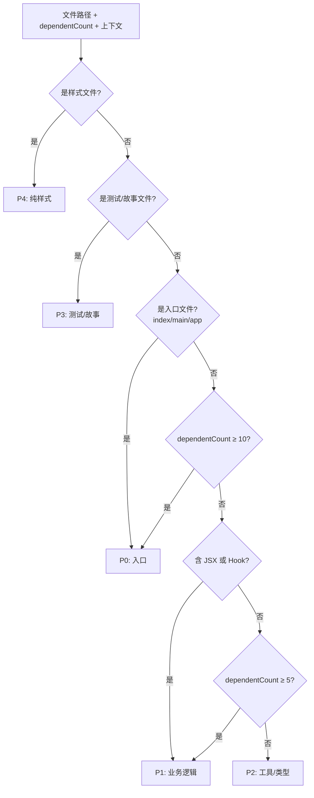
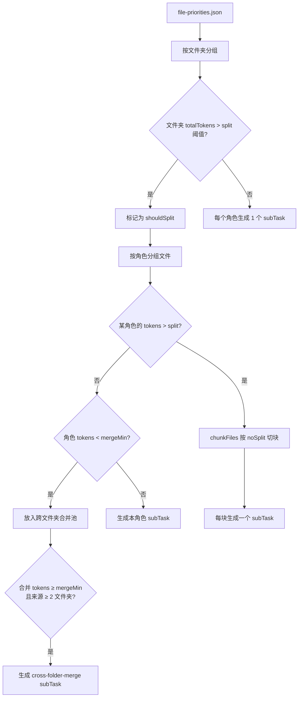
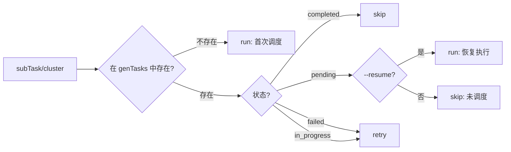
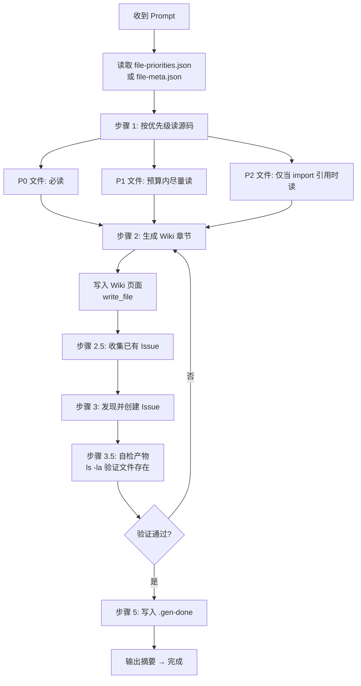
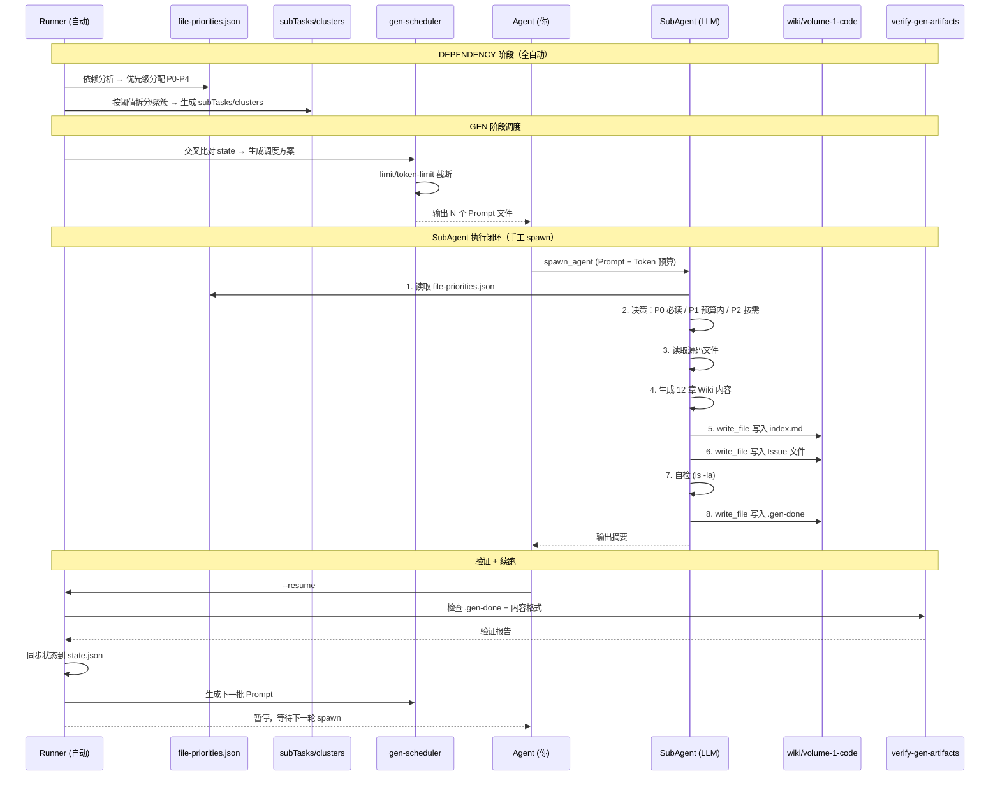

# 6.4 从优先级到 Wiki 产出：SubAgent 闭环任务全流程

> 追踪一个文件从被分配 P0-P4 优先级，到被 SubAgent 消费，最终产出 Wiki 页面的完整闭环。

---

## 总览

```
                              ┌──────────────────────────────────┐
                              │         DEPENDENCY 阶段          │
                              │  (自动, 无需 Agent 介入)         │
                              │                                  │
  ┌─────────┐   ┌──────────┐ │  ┌──────────┐   ┌────────────┐   │
  │ 源码文件  │→→│ 依赖分析   │→→│ 优先级分配  │→→│ 任务构建    │   │
  │          │   │(cruiser) │ │  │(P0-P4)   │   │(subTasks/  │   │
  │          │   │          │ │  │          │   │ clusters)  │   │
  └─────────┘   └──────────┘ │  └──────────┘   └────────────┘   │
                              └──────────────────────────────────┘
                                           │
                                           ▼
                              ┌──────────────────────────────────┐
                              │         GEN 阶段                 │
                              │  (Runner 调度 + Agent spawn)     │
                              │                                  │
                              │  ┌────────────┐                  │
                              │  │ 批次调度     │  ← 按 limit/    │
                              │  │            │     token-limit  │
                              │  └─────┬──────┘                  │
                              │        │                         │
                  ┌───────────┴───────────┐                    │
                  │  SubAgent Prompt      │                    │
                  │  (含 Token 预算)       │                    │
                  └───────────┬───────────┘                    │
                              │                                 │
                  ┌───────────┴───────────┐                    │
                  │  SubAgent 执行闭环     │                    │
                  │  (见下文详细流程)      │                    │
                  └───────────┬───────────┘                    │
                              │                                 │
                  ┌───────────┴───────────┐                    │
                  │  verify-gen-artifacts │                    │
                  │  验证 + 状态同步       │                    │
                  └───────────────────────┘                    │
                              │                                 │
                              ▼                                 │
                    ┌──────────────────┐                        │
                    │   Wiki/Issue 输出  │                        │
                    └──────────────────┘                        │
                              │                                 │
                              ▼                                 │
                    ┌──────────────────┐                        │
                    │  ASSEMBLE 阶段    │→→→ 成书 + 去重 + 经验  │
                    └──────────────────┘                        │
                              │                                 │
                              ▼                                 │
                    ┌──────────────────┐                        │
                    │  VALIDATE 阶段    │→→→ Done!              │
                    └──────────────────┘                        │
                              │                                 │
                              ▼                                 │
                         ✅ DONE                                │
                              └──────────────────────────────────┘
```

---

## Step 1：优先级分配（DEPENDENCY 阶段）

### 1.1 输入

| 数据 | 来源 | 内容 |
|:---|:---|:---|
| `file-list.json` | `scan-files.ts` | 项目所有源码文件路径（.ts/.tsx/.js/.jsx 等） |
| `dependency-graph.json` | `build-deps.ts`（依赖 cruiser） | 每个文件的 `dependents[]`（谁依赖它） |
| 源码文件本身 | 磁盘上的物理文件 | 文件内容（前 8KB 用于正则检测） |

### 1.2 上下文提取（`readFileContext`）

`file-priorities.ts` 对每个文件读取前 8KB，用正则检测：

```typescript
function readFileContext(filePath: string): FileContext {
  const head = content.slice(0, 8192);
  return {
    lineCount: content.split("\n").length,
    hasJSX:    /<[A-Z]\w+|<\w+\s+(?:ref|key|className|style|on[A-Z])/.test(head),
    hasHook:   /\buse[A-Z]\w+\s*\(/.test(head),         // 匹配 useState 等
  };
}
```

### 1.3 优先级判定（`determinePriority`）



优先级优先级排序：`P0 → P1 → P2 → P3 → P4`

### 1.4 Token 估算（`estimateTokens`）

按文件类型使用加权乘数：

| 文件类型 | 乘数 | 示例 |
|:---|:---:|:---|
| `.d.ts` 纯类型声明 | ×1.0 | `types.d.ts` (100 行 → 100 tokens) |
| `.css` / `.scss` 样式 | ×1.2 | `styles.css` (100 行 → 120 tokens) |
| `.ts` 普通逻辑 | ×1.5 | `utils.ts` (100 行 → 150 tokens) |
| `.tsx` / `.jsx` JSX 文件 | ×2.5 | `Button.tsx` (100 行 → 250 tokens) |

### 1.5 产物

```json
// file-priorities.json（按文件夹分组）
{
  "folders": {
    "src/components": {
      "folder": "src/components",
      "totalTokens": 45800,
      "files": [
        { "path": "src/components/index.ts",      "priority": "P0", "estimatedTokens": 200,  "dependentCount": 15 },
        { "path": "src/components/Button.tsx",     "priority": "P1", "estimatedTokens": 5800, "dependentCount": 8  },
        { "path": "src/components/Dropdown.tsx",   "priority": "P1", "estimatedTokens": 4200, "dependentCount": 3  },
        { "path": "src/components/helpers.ts",     "priority": "P2", "estimatedTokens": 800,  "dependentCount": 0  },
        { "path": "src/components/Button.test.ts", "priority": "P3", "estimatedTokens": 3000, "dependentCount": 0  },
        { "path": "src/components/styles.css",     "priority": "P4", "estimatedTokens": 200,  "dependentCount": 0  }
      ]
    }
  }
}
```

同时，`extract-file-meta.ts` 生成另一份元信息：

```json
// file-meta.json（按文件路径索引）
{
  "src/components/Button.tsx": {
    "lineCount": 232,
    "estimatedTokens": 5800,
    "hasJSX": true,
    "isReactComponent": true,
    "componentName": "Button",
    "hookNames": ["useState", "useCallback"],
    "exportNames": ["Button", "ButtonProps"],
    "propTypeNames": ["ButtonProps"]
  }
}
```

---

## Step 2：任务构建（DEPENDENCY 阶段）

### 2.1 文件夹模式（`analyze-folders.ts`）



动态阈值（基于项目总 Token）：

```
split    = clamp(projectTotal × 5%,   [20_000, 150_000])
noSplit  = clamp(projectTotal × 2.5%, [10_000,  80_000])
mergeMin = clamp(projectTotal × 0.3%, [ 3_000,  15_000])
```

`chunkFiles()` 贪心切块逻辑：

```typescript
for (const file of files) {
  if (currentTokens + file.estimatedTokens > maxTokens && current.length > 0) {
    chunks.push(current);  // 超额就切
    current = []; currentTokens = 0;
  }
  current.push(file);
  currentTokens += file.estimatedTokens;
}
```

产物 `folder-strategy.json` 中的 subTask 结构：

```json
{
  "subTasks": [{
    "id": "src/components__ui_components_1",
    "label": "UI Components (1)",
    "role": "ui_components",
    "files": ["src/components/Button.tsx", "src/components/Input.tsx"],
    "estimatedTokens": 10000,
    "wikiChapter": "ch-src-components/ui_components/part-1.md"
  }]
}
```

### 2.2 聚簇模式（`cluster-tasks.ts`）

按依赖关系图的 BFS 遍历聚簇，替代文件夹分组：

```
阈值（基于项目总 Token）：
  maxCluster = clamp(projectTotal × 25%, [1_000, 120_000])
  minCluster = clamp(projectTotal ×  5%, [   50,  15_000])

流程：
  1. 选种子（被依赖最多的组件文件）→ BFS 遍历依赖
  2. 累积文件直到接近 maxCluster → 形成一个聚簇
  3. < minCluster 的归入孤儿池 → 按目录合并或附加到相近聚簇
  4. > maxCluster 的 → normalizeClusters() 拆分
```

聚簇模式比文件夹模式减少 **50-60% 的 SubAgent 数**。

产物 `task-clusters.json` 中的聚簇结构：

```json
{
  "clusters": [{
    "id": "cluster-btn-input",
    "label": "按钮与输入框组件",
    "files": ["src/components/Button.tsx", "src/components/Input.tsx", "src/hooks/useForm.ts"],
    "estimatedTokens": 14500,
    "wikiChapter": "ch-cluster-btn-input/index.md",
    "priority": "high",
    "source": "component"
  }]
}
```

---

## Step 3：批次调度（GEN 阶段）

### 3.1 交叉比对状态

`gen-scheduler.ts` 读取 `state.json` 的 `genTasks[]` 与 `task-clusters.json` 或 `folder-strategy.json` 的聚簇/subTask 列表：



### 3.2 批次截断

排序后（retry 优先于 run），按两个维度截断：

```typescript
// 方式 A：按任务数截断（--limit，默认 5）
if (limit && schedule.length > limit) {
  schedule.length = limit;
}

// 方式 B：按 Token 总额截断（--token-limit，覆盖 --limit）
if (tokenLimit && tokenLimit > 0) {
  let tokenSum = 0;
  for (let i = 0; i < schedule.length; i++) {
    if (tokenSum + schedule[i].estimatedTokens > tokenLimit) break;
    tokenSum += schedule[i].estimatedTokens;
    cutoffIdx = i + 1;
  }
  schedule.length = cutoffIdx;
}
```

Runner 中的决策逻辑：

```typescript
if (args.tokenLimit && args.tokenLimit > 0) {
  genArgs.push("--token-limit", String(args.tokenLimit));  // 按 Token 总额控制
} else {
  genArgs.push("--limit", String(args.limit));             // 按任务数控制（默认 5）
}
```

### 3.3 Token 预算公式

每个被调度的 SubAgent 的 Prompt 中注入 `calcTokenBudget()` 结果：

```typescript
function calcTokenBudget(estimatedTokens: number, projectTotalTokens?: number): number {
  // 分段公式：
  //   ≤10K  → estimatedTokens × 2.5 + 8_000
  //   ≤50K  → estimatedTokens × 2.0 + 10_000
  //   >50K  → estimatedTokens × 1.5 + 15_000
  // 项目总量 30% 封顶
  // 全局上限 200K，下限 15K

  let budget = estimatedTokens <= 10_000  ? estimatedTokens * 2.5 + 8_000
             : estimatedTokens <= 50_000  ? estimatedTokens * 2.0 + 10_000
             : estimatedTokens * 1.5 + 15_000;

  if (projectTotalTokens) budget = Math.min(budget, projectTotalTokens * 0.3);
  return Math.max(15_000, Math.min(200_000, Math.round(budget)));
}
```

示例：

| 任务规模 | estimatedTokens | calTokenBudget | 含义 |
|:---|:---:|:---:|:---|
| 小 | 5K | 20.5K | 小文件夹，给充足余量探索 |
| 中 | 30K | 70K | 中等大小，适度缓冲 |
| 大 | 80K | 135K | 大文件夹，紧贴实际需求 |
| 超大 | 200K+ | 200K (cap) | 已达到上限，不再放大 |

---

## Step 4：SubAgent 执行闭环（核心）

这是整个系统中 **唯一需要 Agent 手工介入** 的步骤。每个 SubAgent 收到一个 Prompt 后，执行以下闭环流程：



### 4.1 读取优先级/元信息

**文件夹模式**的 Prompt 指令：

```
### 步骤 1：按优先级读取源文件
1. 读取 file-priorities.json，找到文件夹 "<folder>" 的条目
2. 读取所有 P0 文件（入口文件、桶文件）— **始终读取**
3. 在 token 预算允许的条件下读取 P1 文件（核心逻辑：组件、Hooks、状态管理）
4. 仅在 P0/P1 的 import 语句引用时读取 P2 文件（工具函数、类型定义）— **按需读取**
5. 跳过 P3 和 P4 文件（测试、样式）
6. 记录你实际读取了哪些文件
```

**聚簇模式**的 Prompt 指令（略有不同，元信息已预提取到 Prompt 中）：

```
### 步骤 1：选择性读取源码
1. 以上表格已包含组件名、Hooks、导出列表 — 优先据此判断重要性
2. 仅当表格信息不足时再读完整源码（优先读有 JSX/组件的文件）
3. 在 token 预算允许的条件下选择性读取关键文件的完整源码
4. 跳过测试和样式文件
5. 记录你实际读取了哪些文件
```

### 4.2 SubAgent 的读取决策模型

```
         file-priorities.json
         ┌────────────────────────────┐
         │ 文件夹: src/components      │
         │   P0: index.ts     200 tok │  ←── 必读
         │   P1: Button.tsx  5800 tok │  ←── 预算内读
         │   P1: Input.tsx   4200 tok │  ←── 预算内读
         │   P2: helpers.ts   800 tok │  ←── 按需读
         │   P3: *.test.ts          │  ←── 跳过
         │   P4: *.css              │  ←── 跳过
         └────────────────────────────┘
                     │
                     ▼
         Token 预算: 20500（例如）
         ┌────── 如何分配？──────┐
         │ P0 读取: 200 tokens   │  ← 必读
         │ P1 读取: 5800+4200    │  ← 预算充足，全读
         │ P2 读取: 800 (按需)   │  ← 仅当 import 引用
         │ 剩余: 9500 tokens     │  ← 用于生成和 Issue 检测
         └───────────────────────┘
```

### 4.3 生成 Wiki 页面（12 章结构）

SubAgent 生成 Wiki 必须严格遵循 12 章结构：

```
## 目录（章节号 + 标题列表）
## 1. 需求背景           ← 从代码注释/命名/调用上下文推断业务意图
## 2. 架构概述           ← 整体架构、设计模式、项目定位
## 3. 组件/函数清单      ← 表格：名称 | 类型 | 用途 | 源文件
## 4. 技术实现方案       ← 核心实现思路、关键算法/模式、状态管理
## 5. 实现细节           ← 签名、Props、状态管理、生命周期、错误处理
## 6. 依赖关系           ← Mermaid 图 ≤ 30 节点 + 依赖说明
## 7. 数据流             ← 入：来源 | 出：去向 | 内：流转
## 8. 公共组件索引清单   ← 导出名 | 导入路径 | 签名 | 示例
## 9. 设计决策与替代方案  ← 推断的设计选择与技术权衡
## 10. 使用示例          ← 外部代码如何引用
## 11. Issue 分析        ← 11.1 已知 + 11.2 新发现 + 11.3 汇总表
## 12. 相关章节          ← Obsidian wiki 链接格式
```

每页都带有 YAML frontmatter：

```yaml
---
tags: [components, ui]
lastUpdated: 2026-06-29
sourceFiles:
  - src/components/Button.tsx
  - src/components/Input.tsx
---
```

### 4.4 Issue 检测与创建

SubAgent 在分析源码时同步检测问题，按 3 层优先级体系分类：

| 类型 | 层级 | 检测项示例 |
|:---|:---:|:---|
| bug | 🔴 P0 | 空值访问、错误被吞、闭包陷阱、竞态 |
| security | 🔴 P0 | XSS (dangerouslySetInnerHTML)、JSON.parse 无 try-catch |
| typescript | 🟡 P1 | any ≥ 3 处、缺 Props 接口、@ts-ignore |
| performance | 🟡 P1 | 不必要渲染、大列表无虚拟化 |
| dead_code | 🟢 P2 | 注释代码块、未使用导入、console.log |
| complexity | 🟢 P2 | 组件 > 200 行、嵌套 > 4 层 |
| maintainability | 🟢 P2 | 重复代码、Magic Number、命名不一致 |
| ux | 🟢 P2 | 缺 loading、空状态无提示、错误反馈缺失 |

输出格式为独立 Issue 文件：

```markdown
---
id: IS-0001-HIGH-button-missing-key-prop
type: bug
severity: high
confidence: high
status: detected
detected_at: 2026-06-29T10:00:00.000Z
source_files:
  - src/components/Button.tsx
---
...
```

### 4.5 自检（步骤 3.5）

Prompt 强制要求 SubAgent 执行自检：

```bash
ls -la ${projectRoot}/wiki/volume-1-code/${wikiChapter}
ls -la ${projectRoot}/wiki/volume-2-issues/ch-*/IS-*.md | tail -5
```

确认 `index.md` 存在且 `size > 0`。如果文件不存在，必须重新用 `write_file` 写入。这一步是防止 "只说不写" 的关键屏障。

### 4.6 完成标记（步骤 5）

所有产物确认无误后，写入完成标记文件：

```typescript
write_file(${wikiChapterDir}/.gen-done,
  "generated_at: 2026-06-29T10:00:00.000Z\nsubagent: completed")
```

`.gen-done` 标记文件是 Runner 后续恢复时判断 SubAgent 是否真正完成写入的依据。

---

## Step 5：验证 + 状态同步

Agent 完成一批 SubAgent 后，运行 `--resume`，Runner 自动执行：

### 5.1 验证（`verify-gen-artifacts.ts`）

```
验证项：
├── 检查已完成任务的 wiki 目录是否存在
├── 检查 .gen-done 标记文件是否存在且格式正确
├── 扫描 Mermaid 泄露文件（误写入磁盘的图节点文件）
└── 核对 Wiki 中的 Issue 引用与 volume-2-issues/ 中的文件是否一致

状态判定：
├── 目录存在 + .gen-done 存在 + 内容格式正确 → ✅ 通过
├── 标记为 completed 但目录缺失 → ⚠️ 状态-磁盘不一致 → 重置为 pending（最多 3 次）
├── 超过 3 次仍失败 → ❌ 标记为 failed → 跳过（不阻塞流水线）
└── 有 Mermaid 泄露 → 🧹 自动清理
```

### 5.2 状态同步（`sync-gen-tasks.ts`）

```
1. 扫描 wiki/volume-1-code/ 下的所有目录
2. 对比 state.json 中的 genTasks
3. 有目录 + .gen-done 的 → 状态置为 completed
4. 写入 state.json
```

### 5.3 生成下一批 Prompt

如果还有未完成的 GEN 任务，Runner 自动：

```
1. 重新注入最新的反馈策略到 Prompt 末尾
2. 生成下一批 Prompt 文件到 .agentic-wiki/gen-prompts/
3. 暂停 → 等待 Agent 再次 spawn SubAgent
```

---

## 完整闭环时序图



---

## 关键设计要点

### 为什么 SubAgent 需要自己做读取决策？

因为 Prompt 中的 Token 预算只是一个**上限指导**，SubAgent 在运行时才知道：
- 文件实际内容有多复杂
- 需要读多少才能生成完整的 12 章
- 源码中发现了多少 Issue 需要创建

所以系统设计为 **"建议 + 自决"** 模式：告诉 SubAgent 优先级顺序和预算上限，让它在执行时灵活调整。

### 两个模式的读取差异

| 维度 | 文件夹模式 | 聚簇模式 |
|:---|:---|:---|
| 信息来源 | `file-priorities.json` | `file-meta.json`（预提取到 Prompt） |
| P0/P1 区分 | 明确标注 P0-P4 | 无优先级标注，用"有 JSX/组件"判断 |
| 按需读取 | P2 按 import 引用读取 | 表格信息不足时再读源码 |
| 元信息 | 只有 estimatedTokens | 含组件名、Hooks、导出列表、Props 类型 |

### Token 预算的三层控制

```
第 1 层: estimatedTokens（文件级） ← 按文件类型 × 乘数
     ↓
第 2 层: subTask/cluster estimatedTokens（任务级） ← 各文件累计
     ↓
第 3 层: calcTokenBudget()（SubAgent 级） ← 分段公式 + 上下限
     ↓
第 4 层: --limit / --token-limit（批次级） ← 调度截断
```

每一层都比上一层更粗粒度，从微观到宏观逐层控制 Token 消耗。

---

> **上一篇**: [6.3 Agent 工作流](03-agent-workflow.md) | **下一篇**: [第七章 ASSEMBLE 阶段](../07-assemble-phase.md)
