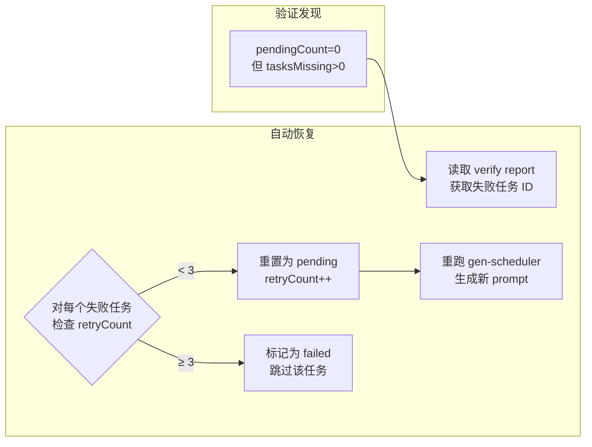

# 11.10 状态-磁盘一致性检查

> 检测 state.json 标记 completed 但磁盘产物缺失的不一致状态，自动重置并重试。

---

## 背景

流水线可能因各种原因进入状态与磁盘不一致的情况：

| 场景 | 后果 |
|:---|:---|
| SubAgent 声明完成但未写文件 | state.json 中 genTask 标记为 completed，但磁盘上无产物 |
| SubAgent 执行中断 | `.gen-done` 标记缺失或内容不完整 |
| SubAgent 只写了极短的内容 | 文件存在但小于 500 字节，内容可能是空话 |
| 磁盘被清理/回滚 | genTasks 仍标记 completed 但目录已消失 |

## 方案

`verify-gen-artifacts.ts` 在 `--resume` 时执行一致性检查，但**不再阻断流水线**。改为自动重置：



### 重试上限

每个聚簇任务最多自动重试 **3 次**。超过后标记为 `failed`，跳过该任务，流水线继续推进。

关键代码（`runner.ts`）：

```typescript
const MAX_RETRIES = 3;

for (const task of state.genTasks) {
  if (验证失败 && task.status === "completed") {
    if ((task.retryCount || 0) >= MAX_RETRIES) {
      task.status = "failed";           // 超过上限 → 放弃
      task.lastError = `超过最大重试次数 (${MAX_RETRIES})`;
    } else {
      task.status = "pending";          // 自动重置
      task.retryCount = (task.retryCount || 0) + 1;
    }
  }
}
```

### 新增的验证项

| 检查 | 说明 |
|:---|:---|
| `.gen-done` 内容合法性 | 必须包含 `subagent: completed` 和 `generated_at:` 两行 |
| 主文件最小大小 | 当目录只有 1 个 `.md` 文件且 < 500 字节 → 判定为内容过短 |

## 修正方式对比

| 旧方案 | 新方案 |
|:---|---:|
| `process.exit(1)` 阻断流水线 | 自动重置为 `pending`，重试 |
| 提示人工运行诊断命令 | 自动读取 verify report 定位失败任务 |
| `--force` 重置整个流水线 | 最多重试 3 次，超限后跳过单任务 |
| 无法区分单任务失败和全量失败 | 精确到 genTask 级别，不影响其他任务 |

---

> **上一篇**: [11.9 SubAgent 完成标记](09-completion-marker.md) | **下一篇**: [11.11 聚簇命名多数投票](11-cluster-naming.md)
