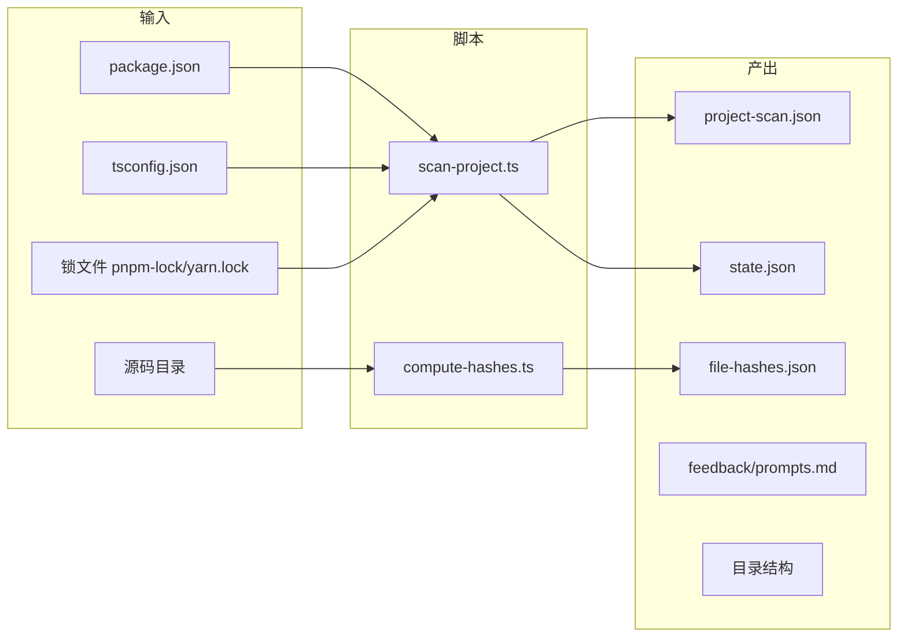
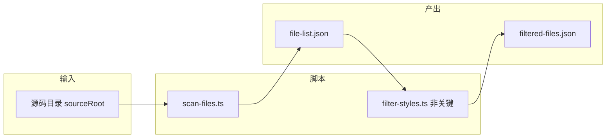
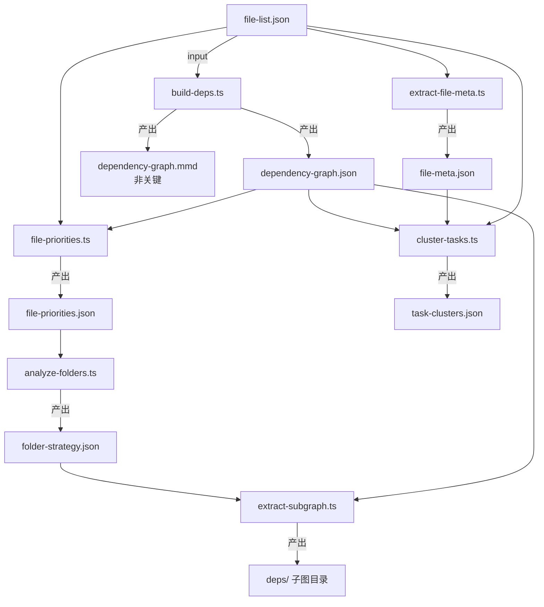
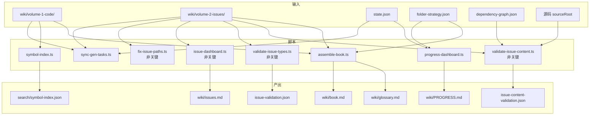
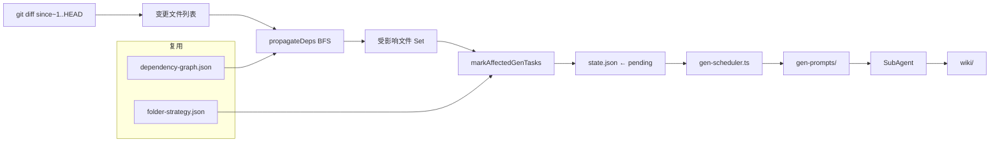

# 附录 A：流水线全链路数据流分析

> 详细分析 AgenticWiki 6 阶段流水线的数据依赖关系——每个阶段消费什么、产出什么、各阶段如何衔接推进。

---

## A.1 全景总览

AgenticWiki 的流水线由 6 个阶段组成，定义在 `phase-definitions.ts` 的 `DAG_ORDER` 中：


**规则**：

| 规则 | 说明 |
|:---|:---|
| **阶段间严格串行** | 前一阶段所有产物就绪后，后一阶段才能启动 |
| **阶段内脚本可并发** | 只要输入就绪，同一阶段的脚本没有依赖关系 |
| **非关键脚本不阻塞** | 标记 `critical: false` 的脚本失败不影响流水线继续 |
| **GEN 需人工介入** | Runner 产出 prompt 后暂停，等待 Agent spawn SubAgent |
| **状态持久化** | `state.json` 贯穿全生命周期，每阶段完成时更新 `currentPhase` |

---

## A.2 阶段 0：INIT —— 项目初始化

| 属性 | 值 |
|:---|:---|
| **自动化** | ✅ 完全自动 |
| **脚本数** | 2 |
| **关键产物** | `project-scan.json`, `file-hashes.json`, `state.json` |

### 数据流



### 产出文件详解

**`project-scan.json`**——项目元信息快照：

```json
{
  "projectPath": "/Users/.../my-project",
  "scannedAt": "2026-06-02T10:00:00.000Z",
  "techStack": {
    "framework": "next",
    "language": "typescript",
    "hasJSX": true
  },
  "totalFiles": 1234,
  "totalFolders": 89
}
```

| 字段 | 来源 | 后续消费者 |
|:---|---:|:---|
| `techStack.hasJSX` | 扫描 package.json 依赖 | SCAN 阶段的样式过滤决策 |
| `totalFiles` | globby 递归扫描 | 开发人员参考 |
| `hasTypeScript` | tsconfig.json + 文件扫描 | 下游脚本自适应 |

**`file-hashes.json`**——全量文件 SHA256 哈希（增量模式基线）：

```json
{
  "src/components/Button.tsx": "a1b2c3d4...",
  "src/hooks/useAuth.ts": "e5f6g7h8..."
}
```

| 消费者 | 用途 |
|:---|---:|
| 增量模式 | 对比当前 hash 与基线，检测文件变更 |

**`state.json`**——流水线"大脑"：

```json
{
  "schemaVersion": 1,
  "currentPhase": "INIT",
  "phaseHistory": [
    { "phase": "INIT", "status": "completed", "completedAt": "..." }
  ],
  "config": { "paths": { ... }, "mode": "full" }
}
```

6 个阶段全程读写 `state.json`。Runner 通过 `state.currentPhase` 决定从哪个阶段继续或恢复。

---

## A.3 阶段 1：SCAN —— 文件扫描与样式过滤

| 属性 | 值 |
|:---|:---|
| **自动化** | ✅ 完全自动 |
| **脚本数** | 2（其中 1 个非关键） |
| **关键产物** | `file-list.json` |

### 数据流



### 产出文件详解

**`file-list.json`**——DEPENDENCY 阶段所有脚本的入口数据：

```json
{
  "scannedAt": "2026-06-02T10:00:05.000Z",
  "sourcePath": "/Users/.../my-project/src",
  "totalFiles": 870,
  "files": [
    "components/Button.tsx",
    "components/Input.tsx",
    "hooks/useAuth.ts"
  ],
  "byExtension": { ".ts": 400, ".tsx": 300, ".js": 50 }
}
```

| 消费者 | 用途 |
|:---|---:|
| `build-deps.ts` | 需要文件列表作为依赖图构建的起点 |
| `file-priorities.ts` | 需要逐文件分析优先级和 Token |
| `extract-file-meta.ts` | 需要逐文件提取元信息 |
| `cluster-tasks.ts` | 需要文件列表来执行依赖聚簇 |

**`filtered-files.json`**——非关键产物，标注了样式/非样式的过滤结果。当前未在后续脚本中被硬性消费，主要供调试参考。

---

## A.4 阶段 2：DEPENDENCY —— 依赖分析与策略规划

| 属性 | 值 |
|:---|:---|
| **自动化** | ✅ 完全自动 |
| **脚本数** | 7 |
| **关键产物** | `dependency-graph.json`, `file-priorities.json`, `folder-strategy.json`, `file-meta.json`, `task-clusters.json` |

这是**脚本最多、产物最密集**的阶段，也是流水线的核心数据生产阶段。

### 脚本依赖拓扑



### 7 个脚本逐一分析

#### `build-deps.ts` — 依赖图构建

| 属性 | 值 |
|:---|:---|
| 输入 | `file-list.json` + 源码目录 |
| 输出 | `dependency-graph.json` (JSON 格式) + `dependency-graph.mmd` (Mermaid 可视化，非关键) |
| 耗时 | 大型项目可能超过 5 分钟，需 `--timeout 300000` |

内部调用 `dependency-cruiser` CLI，输出结果后按 `ModuleInfo` 格式解析：

```json
// dependency-graph.json 的一条记录
{
  "source": "components/Button.tsx",
  "dependencies": [
    { "source": "components/Button.styles.ts", "type": "local" },
    { "source": "react", "type": "external" }
  ],
  "dependents": [
    "pages/Dashboard.tsx",
    "pages/Settings.tsx"
  ]
}
```

下游消费链最长的产物：

| 消费者 | 消费方式 |
|:---|---:|
| `file-priorities.ts` | 查询 `dependents.length` 得到被依赖数，影响优先级判定 |
| `extract-subgraph.ts` | 为每个 subTask 提取局部子图 |
| `cluster-tasks.ts` | BFS 遍历依赖关系做聚簇 |
| `validate-issue-content.ts` | 验证 Issue 中的依赖断言 |
| `validate-code-refs.ts` | 验证 Wiki 中声明的依赖与实际一致 |

#### `file-priorities.ts` — 优先级分配

| 属性 | 值 |
|:---|:---|
| 输入 | `file-list.json` + `dependency-graph.json` + 源码目录 |
| 输出 | `file-priorities.json` |

逐文件执行：

1. `getLineCount()` — 直接读文件、数换行符（比 `wc -l` fork 快 10-30 倍）
2. `estimateTokens()` — 按文件类型乘以不同系数（TSX 2.5x, CSS 1.2x, TS 1.5x, d.ts 1.0x）
3. `determinePriority()` — 综合被依赖数 + 文件名模式判定 P0~P4

```json
// file-priorities.json 的一条记录
{
  "path": "src/components/Button.tsx",
  "priority": "P1",
  "lineCount": 120,
  "estimatedTokens": 300,
  "dependentCount": 2,
  "reason": "P1: 2 dependents"
}
```

> **重要**：`estimatedTokens` 是整个动态阈值系统的基础。所有文件夹的 `estimatedTokens` 之和就是 `totalProjectTokens`，进而决定了 split / noSplit / mergeMin 三个阈值。

下游消费：

| 消费者 | 消费内容 |
|:---|---:|
| `analyze-folders.ts` | 充要输入——文件夹拆分策略完全基于此文件 |

#### `analyze-folders.ts` — 文件夹拆分策略

| 属性 | 值 |
|:---|:---|
| 输入 | `file-priorities.json` |
| 输出 | `folder-strategy.json` |

核心流程：

```
输入 file-priorities.json
  → calcThresholds(totalProjectTokens)  动态计算 split/noSplit/mergeMin
  → 按文件夹分组
    → 每个文件夹内按 role 分组（ui-components / hooks / utils / types / entry / ...）
      → role 组 > split → chunkFiles(files, noSplit) 贪心切块
      → role 组 < mergeMin → 跨文件夹合并候选
  → 输出 folder-strategy.json
```

```json
// folder-strategy.json 片段
{
  "folders": [
    {
      "path": "src/pages",
      "totalTokens": 180000,
      "shouldSplit": true,
      "subTasks": [
        { "id": "pages_ui-components_1", "files": ["Dashboard.tsx", ...], "estimatedTokens": 34000 },
        { "id": "pages_hooks_1", "files": ["useAuth.ts", ...], "estimatedTokens": 5000 }
      ]
    }
  ],
  "crossFolderMerges": [
    { "id": "merge_utils_1", "files": [...], "estimatedTokens": 2800 }
  ]
}
```

下游消费链：

| 消费者 | 消费内容 |
|:---|---:|
| `extract-subgraph.ts` | 按 `subTasks[].files` 提取局部子图 |
| `gen-scheduler.ts` | 按 `subTasks[]` 生成调度计划（当无 `task-clusters.json` 时） |
| `progress-dashboard.ts` | 构建进度面板 |
| `assemble-book.ts` | 确定章节结构和页码 |

#### `extract-subgraph.ts` — 子图提取

| 属性 | 值 |
|:---|:---|
| 输入 | `dependency-graph.json` + `folder-strategy.json` |
| 输出 | `deps/` 目录（每个 subTask 一个 JSON 子图文件） |

为每个 subTask 生成一个独立子图文件，供 SubAgent 在 GEN 阶段理解局部依赖关系：

```
.agentic-wiki/cache/deps/
├── pages_ui-components_1.json
├── pages_hooks_1.json
└── ...
```

#### `extract-file-meta.ts` — 文件元信息提取

| 属性 | 值 |
|:---|:---|
| 输入 | `file-list.json` + 源码目录 |
| 输出 | `file-meta.json` |

> 每个文件的行数、是否 JSX、估算 Token、是否为 barrel file。

```json
{
  "src/components/Button.tsx": {
    "lineCount": 120,
    "estimatedTokens": 300,
    "hasJSX": true,
    "isBarrel": false
  }
}
```

| 消费者 | 用途 |
|:---|---:|
| `cluster-tasks.ts` | `fileTokens()` 查找函数，为每个文件返回 Token 数 |
| SubAgent | 可选参考，了解文件规模 |

#### `cluster-tasks.ts` — 依赖聚簇划分

| 属性 | 值 |
|:---|:---|
| 输入 | `dependency-graph.json` + `file-meta.json` + `file-list.json` |
| 输出 | `task-clusters.json` |

使用种子扩展算法（类似社区发现）将依赖紧密的文件划分到同一聚簇，替代文件夹+role 的分组方式，**减少 50-60% 的子任务数**。

```json
{
  "clusters": [
    {
      "id": "cluster_auth_flow",
      "name": "认证流程",
      "files": ["src/hooks/useAuth.ts", "src/pages/Login.tsx", "src/services/auth.ts"],
      "estimatedTokens": 12000
    }
  ]
}
```

当 `task-clusters.json` 存在时，GEN 阶段的 `gen-scheduler.ts` 会优先使用它而非 `folder-strategy.json`——完全自动判断，无需 Agent 干预。

### 本阶段产出汇总

```
.agentic-wiki/cache/
├── dependency-graph.json        # 全量依赖图 —— 最长消费链
├── dependency-graph.mmd         # Mermaid 可视化 —— 非关键
├── file-priorities.json         # 文件优先级 + Token —— folder-strategy 的唯二输入
├── folder-strategy.json         # 拆分策略 —— GEN / ASSEMBLE 的核心输入
├── deps/                        # 子图目录 —— SubAgent 可选参考
├── file-meta.json               # 文件元信息 —— cluster-tasks + SubAgent 参考
└── task-clusters.json           # 依赖聚簇 —— GEN 阶段可选替代方案
```

---

## A.5 阶段 3：GEN —— Wiki 生成

| 属性 | 值 |
|:---|:---|
| **自动化** | ⚡ 半自动（Runner 自动 + Agent 手动 spawn SubAgent） |
| **脚本数** | 1（Runner 端） + N × SubAgent |
| **关键产物** | `wiki/volume-1-code/` + `wiki/volume-2-issues/` |

### 数据流

```mermaid
flowchart TB
    subgraph 输入_缓存[缓存层输入]
        FS[folder-strategy.json]
        TC[task-clusters.json\n优先使用]
        ST[state.json]
    end
    
    subgraph Runner_自动[Runner 自动]
        GS[gen-scheduler.ts]
        FI[injectFeedbackIntoPrompts]
    end
    
    subgraph 临时_产物[临时产物]
        SCH[gen-schedule.json]
        GP[gen-prompts/{id}.md]
    end
    
    subgraph SubAgent_手动[Agent spawn SubAgent]
        SA[SubAgent × N]
        WIKI[wiki/volume-1-code/]
        ISS[wiki/volume-2-issues/]
        MARK[.gen-done 标记文件]
    end
    
    FS --> GS
    TC -.-> GS
    ST --> GS
    GS --> SCH
    GS --> GP
    
    GP --> FI
    FI --> SA
    
    SA --> WIKI
    SA --> ISS
    SA --> MARK
```

### Runner 自动部分

`gen-scheduler.ts` 执行：

1. **交叉比对**：读取 `state.genTasks` 和 `folder-strategy.subTasks`（或 `task-clusters`），过滤已完成任务
2. **调度分类**：每个子任务被标记为 `skip`（已完成）或 `run`（待执行）
3. **Prompt 生成**：为每个 `run` 任务生成一个独立的 Markdown prompt 文件
4. **反馈注入**：从 `feedback/prompts.md` 读取历史改进策略，注入到 prompt 中
5. **模板嵌入**：自动生成 `issue-rules.md`、`output-format.md`、`path-safety.md` 到 `.agentic-wiki/templates/`

**关键数据——`gen-schedule.json`**：

```json
{
  "skip": [{ "id": "components_button_1", "action": "skip", "reason": "already completed" }],
  "schedule": [{ "id": "pages_ui-components_1", "action": "run", "estimatedTokens": 34000, "prompt": "..." }],
  "summary": { "totalSubTasks": 42, "runCount": 12, "skipCount": 30, "totalEstimatedTokens": 408000 }
}
```

### Agent 手动部分

1. Agent 读取 `gen-prompts/{id}.md` → 调用 `spawn_agent` 启动 SubAgent
2. SubAgent 读取 prompt（含文件清单、书写规范、输出格式） → 读取源文件 → 生成 Wiki 页面
3. SubAgent **必须**在执行完成后写入 `.gen-done` 标记文件（路径级验证）
4. SubAgent **必须**执行步骤 3.5——用 `ls -la` 验证文件存在且非空

### 本阶段产出

```
wiki/
├── volume-1-code/
│   ├── 01-components/
│   │   ├── README.md                            ← 文件夹级导读
│   │   ├── components_ui-components_1.md         ← SubAgent 产物
│   │   └── components_hooks_1.md
│   └── ...
└── volume-2-issues/
    ├── ch-01-bugs/
    │   └── IS-0001-button-uncontrolled-issue.md  ← SubAgent 发现的 Issue
    ├── ch-02-security/
    └── ...

.agentic-wiki/cache/
├── gen-schedule.json           ← 调度清单
├── gen-prompts/                ← SubAgent prompt 文件
└── templates/                  ← 自动生成的模板文件

.agentic-wiki/
└── feedback/
    └── prompts.md              ← 更新：失败记录自动追加
```

---

## A.6 阶段 4：ASSEMBLE —— Wiki 组装

| 属性 | 值 |
|:---|:---|
| **自动化** | ✅ 完全自动 |
| **脚本数** | 8（其中 4 个非关键） |
| **关键产物** | `book.md`, `glossary.md`, `issues.md`, `symbol-index.json` |

### 数据流



### 8 个脚本逐一分析

| 序号 | 脚本 | 关键性 | 输入 | 输出 | 职责 |
|:---:|:---|:---:|:---|:---|---:|
| 1 | `sync-gen-tasks.ts` | 关键 | `state.json` + `wiki/` | 更新 `state.json` | 扫描 wiki 目录，将已完成的 genTask 标记为 completed |
| 2 | `progress-dashboard.ts` | 关键 | `state.json` + `folder-strategy.json` | `wiki/PROGRESS.md` | 聚簇感知的进度仪表盘，优先从 `state.genTasks` 构建 |
| 3 | `symbol-index.ts` | 关键 | `wiki/` | `search/symbol-index.json` | 从 Frontmatter、标题、代码块提取符号→页面映射 |
| 4 | `fix-issue-paths.ts` | 非关键 | `wiki/volume-2-issues/` | 原地修正 | 将错位的 Issue 文件移到正确章节子目录 |
| 5 | `issue-dashboard.ts` | 非关键 | `wiki/volume-2-issues/` | `wiki/issues.md` | 按类型/优先级/状态聚合 Issue 信息 |
| 6 | `validate-issue-types.ts` | 非关键 | `wiki/volume-2-issues/` | `issue-validation.json` | 校验 Issue type 白名单，`--fix` 自动修正 |
| 7 | `validate-issue-content.ts` | 非关键 | Issues + `dependency-graph.json` + 源码 | `issue-content-validation.json` | 对可量化断言进行脚本验证 |
| 8 | `assemble-book.ts` | 关键 | `wiki/` + `folder-strategy.json` | `wiki/book.md` + `wiki/glossary.md` | 全书组装，生成目录 + 术语表 |

### 最终产出

```
wiki/
├── PROGRESS.md                 ← 进度仪表盘（% 完成）
├── issues.md                   ← Issue 汇总仪表盘
├── book.md                     ← 完整书册（含目录 + 页码索引）
├── glossary.md                 ← 术语表（符号→定义映射）
├── volume-1-code/              ← GEN 阶段产生，已就位
└── volume-2-issues/            ← GEN 阶段产生，已修正路径

.agentic-wiki/
├── cache/
│   ├── issue-validation.json
│   └── issue-content-validation.json
└── search/
    └── symbol-index.json       ← 符号反向索引
```

---

## A.7 阶段 5：VALIDATE —— 交叉引用校验

| 属性 | 值 |
|:---|:---|
| **自动化** | ✅ 完全自动 |
| **脚本数** | 6 |
| **关键标记** | 🟡 非关键阶段（失败不阻塞流水线） |

### 验证层次

```mermaid
flowchart TB
    subgraph 输入
        WIKI[wiki/]
        SR[源码 sourceRoot]
        DG[dependency-graph.json]
    end
    
    subgraph 验证层
        VR[validate-references.ts]
        VCR[validate-code-refs.ts]
    end
    
    subgraph 检查项
        CHECK1[WikiLink [[...]] 目标存在]
        CHECK2[Frontmatter 字段完整]
        CHECK3[源文件存在于磁盘]
        CHECK4[符号名在源文件中出现]
        CHECK5[依赖关系与 depGraph 一致]
    end
    
    subgraph 产出
        RV[reference-validation.json]
        CRV[code-ref-validation.json]
    end
    
    WIKI --> VR
    VR --> CHECK1
    VR --> CHECK2
    VR --> RV
    
    WIKI --> VCR
    SR --> VCR
    DG --> VCR
    VCR --> CHECK3
    VCR --> CHECK4
    VCR --> CHECK5
    VCR --> CRV
```

`validate-references.ts` 和 `validate-code-refs.ts` 均为 `critical: false`，验证报告仅用于质量参考，不影响流水线完成。

### 其他验证脚本

另有 4 个验证脚本在前期阶段已执行：

| 脚本 | 所属阶段 | 验证内容 |
|:---|---:|:---|
| `validate-artifacts.ts` | 任意 | 阶段产物完整性 |
| `validate-paths.ts` | INIT | 路径配置 5 条铁律 |
| `validate-issue-types.ts` | ASSEMBLE | Issue type 白名单 |
| `validate-issue-content.ts` | ASSEMBLE | Issue 可量化断言 |

---

## A.8 增量模式的特殊依赖链

当 `--mode incremental --since HEAD~1` 时，流程大幅简化——跳过 INIT / SCAN / DEPENDENCY：



**关键差异**：

| 对比项 | 全量模式 | 增量模式 |
|:---|---:|:---|
| 阶段数 | 6 | 2（GEN → ASSEMBLE） |
| 依赖图 | 重新构建 | 复用已有 |
| 文件夹策略 | 重新分析 | 复用已有 |
| 变更检测 | 全部文件 | Git diff + BFS 传播 |

`propagateDeps()` 使用 BFS 遍历依赖图：如果一个文件变更了，所有**直接或间接依赖它的文件**也被标记为受影响，确保 Wiki 中的依赖关系保持准确。

---

## A.9 全链路数据总览

### 所有产物汇总

```
阶段    产物                                关键性    消费者
─────  ─────────────────────────────────  ───────  ──────────────────────────────
INIT   project-scan.json                   关键     SCAN 阶段参考
INIT   file-hashes.json                    关键     增量模式基线对比
INIT   state.json                          关键     全部 6 个阶段
INIT   feedback/prompts.md                 关键     GEN 阶段反馈注入
INIT   wiki/ + .agentic-wiki/ 目录结构      关键     所有后续阶段
─────  ─────────────────────────────────  ───────  ──────────────────────────────
SCAN   file-list.json                      关键     DEPENDENCY 阶段全部脚本
SCAN   filtered-files.json                 非关键   调试参考
─────  ─────────────────────────────────  ───────  ──────────────────────────────
DEP    dependency-graph.json               关键     6 个下游脚本 + SubAgent 参考
DEP    dependency-graph.mmd                非关键   可视化参考
DEP    file-priorities.json                关键     analyze-folders.ts
DEP    folder-strategy.json                关键     GEN / ASSEMBLE / 增量模式
DEP    deps/ 子图目录                      非关键    SubAgent 可选参考
DEP    file-meta.json                      关键     cluster-tasks.ts + SubAgent 参考
DEP    task-clusters.json                  关键     GEN 阶段（优先替代 folder-strategy）
─────  ─────────────────────────────────  ───────  ──────────────────────────────
GEN    gen-schedule.json                   临时     Runner 调度参考
GEN    gen-prompts/{id}.md                 临时     SubAgent 任务输入
GEN    wiki/volume-1-code/*.md             关键     ASSEMBLE 阶段
GEN    wiki/volume-2-issues/*.md           关键     ASSEMBLE 阶段
GEN    .gen-done                           关键     verify-gen-artifacts 产物验证
─────  ─────────────────────────────────  ───────  ──────────────────────────────
ASM    wiki/PROGRESS.md                    关键     最终产出
ASM    wiki/book.md                        关键     最终产出
ASM    wiki/glossary.md                    关键     最终产出
ASM    wiki/issues.md                      关键     最终产出
ASM    search/symbol-index.json            关键     最终产出
ASM    issue-validation.json               非关键   质量报告
ASM    issue-content-validation.json       非关键   质量报告
─────  ─────────────────────────────────  ───────  ──────────────────────────────
VAL    reference-validation.json           非关键   质量报告
VAL    code-ref-validation.json            非关键   质量报告
```

### 脚本数量分布

| 阶段 | 脚本数 | 其中非关键 | 关键脚本 |
|:---:|:---:|:---:|:---:|
| INIT | 2 | 0 | 2 |
| SCAN | 2 | 1 | 1 |
| DEPENDENCY | 7 | 1 | 6 |
| GEN | 1 + N × SubAgent | 0 | 1 + 所有 SubAgent |
| ASSEMBLE | 8 | 4 | 4 |
| VALIDATE | 2 | 2 | 0 |
| **合计** | **22 + SubAgent** | **8** | **14** |

---

## A.10 附录 B：项目测试与验证要点

> 补充说明运行测试和验证时的实用信息。

### 快速命令

```bash
# 全量测试
npm test                    # → vitest run，32 个测试文件 657 个用例

# ESLint 检查
npm run lint                # → eslint 'src/**/*.ts'，无 error 即通过

# 覆盖率报告
npm run test:coverage       # → 生成 coverage/ 目录

# 运行指定测试文件
npx vitest run src/lib/__tests__/state-manager.test.ts

# 运行测试时附带 ui
npx vitest --ui
```

### 常见测试失败场景

| 失败场景 | 原因 | 修复 |
|:---|:---|:---|
| 路径相关测试失败 | 绝对路径在不同系统上不一致 | 使用 `path.resolve()` 相对化 |
| 状态测试失败 | 并发写入 state.json | 检查文件锁机制（FileLock） |
| 依赖图测试失败 | dependency-cruiser 版本变更 | 检查 cruiser 输出格式 |
| 快照测试失败 | SubAgent Prompts 输出格式变更 | 更新快照 `npx vitest --update` |

### 覆盖率收集策略

- 使用 `c8`（通过 vitest 配置）
- 排除 `src/types/`（纯类型定义）和 `src/runner.ts`（入口文件）
- 阈值在 `vitest.config.js` 中配置：lines ≥ 85%, functions ≥ 85%, branches ≥ 80%, statements ≥ 85%

### CLI 参数速查

| 参数 | 用途 | 示例 |
|:---|:---|:---|
| `--project` | 目标项目路径（必填） | `--project /path/to/app` |
| `--source` | 源码目录覆盖 | `--source packages/muya/src` |
| `--mode` | 流水线模式 | `--mode incremental` |
| `--resume` | 断点续跑 | `--resume` |
| `--limit` | GEN 每批任务数 | `--limit 10` |
| `--token-limit` | GEN 每批 Token 上限 | `--token-limit 300000` |
| `--to` | 运行到指定阶段停止 | `--to SCAN` |
| `--only` | 仅运行指定阶段 | `--only ASSEMBLE` |
| `--force` | 清除已有状态重置 | `--force` |
| `--dry-run` | 仅展示执行计划 | `--dry-run` |
| `--since` | 增量模式基准 | `--since HEAD~1` |

---

> **上一篇**: [第十二章 开发纪律](12-development-discipline.md) | **回到首页**: [SUMMARY.md](SUMMARY.md)

---

# 附录 C：辅助工具

以下脚本位于 `scripts/` 目录，是**独立于流水线的辅助工具**，不参与 Runner 工作流。

## C.1 `export-issues-csv.ts` — ISSUE 批量导出 CSV

将 `wiki/volume-2-issues/` 下所有 Issue 文件（根级 + 子章节）解析为 CSV，适合在 Excel 中做筛选、排序、透视分析。

### 用法

```bash
npx tsx scripts/export-issues-csv.ts --project project/mini-longfor-online
# 或直接指定 wiki 目录
npx tsx scripts/export-issues-csv.ts --wiki project/mini-longfor-online/wiki
```

### 输出

| 文件 | 内容 |
|:---|:---|
| `<wiki>/issues-export.csv` | 全部 Issue 明细（ID、标题、类型、严重度、优先级、状态、日期、章节、相关文件、摘要） |
| `<wiki>/issues-export-summary.csv` | 汇总报告（概览、按类型/严重度/优先级/章节/状态分布、类型×严重度交叉表、TOP 20 高频文件） |

### 特性

- 自动识别两种 Issue 格式（根级 `IS-XXXX.md` 和章节级 `IS-XXXX-SEVERITY-name.md`）
- 多级 fallback 推断类型：frontmatter `category` → `type` → `tags[0]` → 文件名 → 章节目录名
- 多级 fallback 推断严重度：frontmatter `severity` → 文件名提取
- 归一化别名（`dead-code` → `dead_code`，`LOW` → `low`，`major` → `high` 等）
- UTF-8 BOM 编码，Excel 直接打开不乱码

### 不参与流水线

⚠️ 此脚本不在 Runner 工作流中执行，**仅作为人工分析工具使用**。
