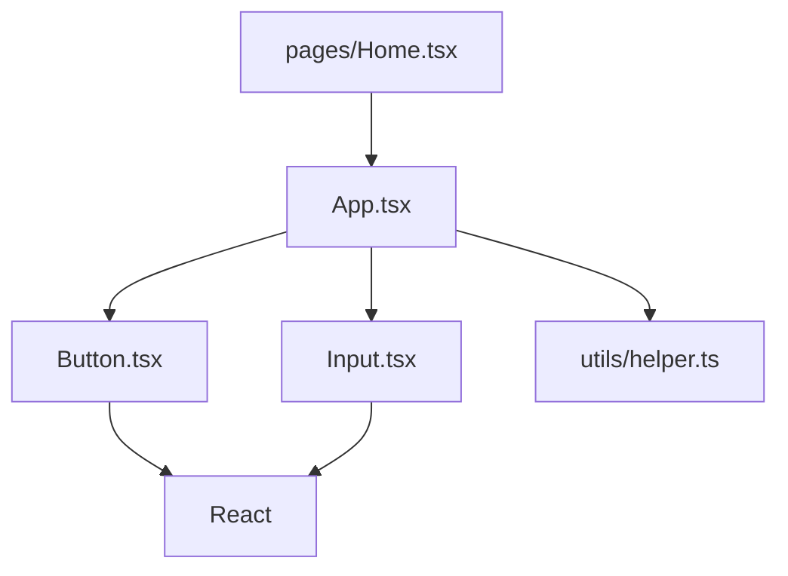

# aw-dependency — 依赖图构建

> 构建模块依赖图，检测循环依赖，分配文件优先级，生成拆分策略，提取子图

## 触发条件

- `aw-scan` Part 1 完成后
- 用户说"分析依赖"、"构建依赖图"
- `aw-orchestrator` 检测到 `currentPhase = DEPENDENCY`

---

## 你的任务

1. 构建模块依赖图（import/require 关系）
2. 检测循环依赖
3. 识别依赖热点（被依赖最多/依赖最多）
4. 生成 Mermaid 可视化图
5. 分配文件优先级（P0-P4 + token 估算）
6. 生成文件夹拆分策略（按角色分组 + 跨文件夹合并）
7. 为每个待分析文件夹提取子图
8. 输出结构化依赖数据

---

## 执行步骤

### Step 1: 构建依赖图（JSON 格式）— 🔧 脚本

使用 `terminal` 工具运行：

```bash
npx tsx src/lib/build-deps.ts --path <源码路径> --output .agentic-wiki/cache/dependency-graph.json --format json
```

**参数说明**：
- `--path`: 源码路径
- `--output`: 输出文件路径
- `--format`: 输出格式（json）

**脚本功能**：
- 使用 `dependency-cruiser` 分析依赖关系
- 支持 TypeScript 路径别名
- 检测循环依赖
- 识别外部依赖 vs 本地依赖

**输出示例**：
```json
{
  "generatedAt": "2026-05-29T10:05:00Z",
  "modules": [
    {
      "source": "src/App.tsx",
      "dependencies": [
        { "resolved": "src/components/Button.tsx", "type": "local", "circular": false },
        { "resolved": "src/utils/helper.ts", "type": "local", "circular": false },
        { "resolved": "react", "type": "external", "circular": false }
      ],
      "dependents": ["src/main.tsx"],
      "hasCircular": false
    }
  ],
  "cycles": [
    {
      "path": ["src/A.ts", "src/B.ts", "src/A.ts"],
      "severity": "error",
      "description": "循环依赖: A → B → A"
    }
  ],
  "hotspots": {
    "mostDepended": [
      { "source": "src/utils/helper.ts", "dependentsCount": 15 }
    ],
    "mostDependent": [
      { "source": "src/pages/Dashboard.tsx", "dependenciesCount": 12 }
    ]
  }
}
```

**自检**：运行后用 `read_file` 读取 `dependency-graph.json`，确认文件存在且包含 `modules` 数组。

---

### Step 2: 生成 Mermaid 可视化 — 🔧 脚本

使用 `terminal` 工具运行：

```bash
npx tsx src/lib/build-deps.ts --path <源码路径> --output .agentic-wiki/cache/dependency-graph.mmd --format mermaid
```

**输出示例**：


**Mermaid 输出特点**：
- 可直接嵌入 Markdown Wiki 页面
- 支持在 Obsidian 中渲染
- 清晰展示模块关系

**自检**：运行后用 `read_file` 读取 `dependency-graph.mmd`，确认文件存在且内容以 `graph` 或 `flowchart` 开头。

---

### Step 3: 分析依赖热点

使用 `read_file` 工具读取 `dependency-graph.json`，然后分析：

**分析维度**：

| 维度 | 说明 | 用途 |
|------|------|------|
| **被依赖最多** | 核心模块，修改影响范围大 | 标记为高优先级分析 |
| **依赖最多** | 复杂模块，逻辑可能复杂 | 标记为深度分析 |
| **循环依赖** | 架构问题，需要修复 | 记录为 Issue |
| **孤立模块** | 未被任何文件依赖 | 可能是死代码 |

**输出到 `dependency-graph.json` 的 `hotspots` 字段**。

---

### Step 4: 记录循环依赖（脚本检测 → SubAgent 格式化）

> **职责划分**：
>
> | 角色 | 职责 | 产物 |
> |------|------|------|
> | `build-deps.ts` 脚本 | 🔧 自动检测循环依赖 | `dependency-graph.json#cycles` |
> | GEN SubAgent | 📝 读取 `cycles` → 格式化 Markdown | `wiki/volume-2-issues/ch-01-circular-deps/IS-*.md` |
>
> **编排器不需要在 DEPENDENCY 阶段生成 Issue 文件**。Issue Markdown 的生成是 GEN 阶段 SubAgent 的职责。
> DEPENDENCY 阶段只需确保 `dependency-graph.json` 中的 `cycles` 字段完整。

---

### Step 5: 🔴 分配文件优先级（🔧 脚本，必须）

> 依赖图构建完成后，为 GEN SubAgent 提供 P0-P4 优先级标注。

使用 `terminal` 工具运行：

```bash
npx tsx src/lib/file-priorities.ts \
  --files .agentic-wiki/cache/file-list.json \
  --deps .agentic-wiki/cache/dependency-graph.json \
  --output .agentic-wiki/cache/file-priorities.json
```

按命名模式、依赖数量、JSX/Hook 检测分配 P0-P4 优先级。

| 优先级 | 条件 | 说明 |
|--------|------|------|
| P0 | 入口文件、被依赖数 > 20 | 核心模块，必须分析 |
| P1 | 被依赖数 > 10、含 JSX/Hook | 重要组件 |
| P2 | 被依赖数 3-10 | 普通模块 |
| P3 | 测试文件、被依赖数 < 3 | 可跳过 |
| P4 | 纯类型定义、常量文件 | 最低优先级 |

**自检**：运行后用 `read_file` 读取 `file-priorities.json`，确认文件存在且包含 `folders` 字段。

---

### Step 6: 🔴 生成文件夹拆分策略（🔧 脚本，必须）

> 基于文件优先级与 token 估算，决定文件夹拆分策略。

使用 `terminal` 工具运行：

```bash
npx tsx src/lib/analyze-folders.ts \
  --input .agentic-wiki/cache/file-priorities.json \
  --output .agentic-wiki/cache/folder-strategy.json
```

**脚本功能**：
- 基于 token 估算拆分文件夹
- 按角色（entry/utils/style/usage）分组
- 识别跨文件夹合并（共享工具/样式文件夹）

**输出示例**：
```json
{
  "generatedAt": "2026-05-29T10:06:00Z",
  "folders": [
    {
      "path": "src/components/",
      "fileCount": 120,
      "totalTokens": 45000,
      "shouldSplit": true,
      "subTasks": [
        { "id": "sub-001", "role": "entry", "files": ["src/components/index.ts"], "estimatedTokens": 200 }
      ],
      "reason": "token 超预算，按角色分组",
      "priority": "high"
    }
  ],
  "totalFolders": 12,
  "foldersToAnalyze": 12,
  "crossFolderMerges": []
}
```

**自检**：运行后用 `read_file` 读取 `folder-strategy.json`，确认文件存在且包含 `folders` 数组。

---

### Step 7: 🔴 提取子图（🔧 脚本，不可跳过）

> ⚠️ 此步骤是 DEPENDENCY 阶段的**强制步骤**，不可跳过。
> GEN SubAgent 依赖子图数据来生成准确的依赖关系图和交叉引用。

#### 7.1 确定文件夹列表

使用 `read_file` 读取 `.agentic-wiki/cache/folder-strategy.json`，获取 `folders[].path` 列表。

#### 7.2 为每个文件夹提取子图

对**每个**待分析文件夹，使用 `terminal` 工具运行：

```bash
npx tsx src/lib/extract-subgraph.ts \
  --deps .agentic-wiki/cache/dependency-graph.json \
  --folder "<文件夹路径>" \
  --output .agentic-wiki/cache/deps/<文件夹名>-deps.json
```

**示例**：

```bash
# 为 dialog 文件夹提取子图
npx tsx src/lib/extract-subgraph.ts \
  --deps .agentic-wiki/cache/dependency-graph.json \
  --folder "project/tdesign-vue-next/packages/components/dialog/" \
  --output .agentic-wiki/cache/deps/dialog-deps.json

# 为另一个文件夹提取子图
npx tsx src/lib/extract-subgraph.ts \
  --deps .agentic-wiki/cache/dependency-graph.json \
  --folder "project/tdesign-vue-next/packages/components/button/" \
  --output .agentic-wiki/cache/deps/button-deps.json
```

#### 7.3 子图产物自检

运行后**必须**逐项确认：

- [ ] 每个文件夹都有对应的 `deps/{folder}-deps.json` 文件
- [ ] 每个子图文件内容非空（使用 `read_file` 检查是否包含 `internalModules` 字段）
- [ ] 子图文件数量 = 待分析文件夹数量

#### 7.4 缺失处理

如果任何子图缺失：
- 标记对应文件夹到 `state.json.blockers`
- **暂停流水线**，不要进入 GEN 阶段
- 向用户展示缺失的子图清单

---

### Step 8: 更新状态 → GEN

使用 `state-manager.ts transition` 完成阶段转换：

```bash
npx tsx {agenticWikiRoot}/src/lib/state-manager.ts transition \
  --state .agentic-wiki/state.json \
  --phase DEPENDENCY \
  --status completed \
  --next-phase GEN \
  --output ".agentic-wiki/cache/dependency-graph.json" \
  --artifacts "dependency-graph.json,dependency-graph.mmd,file-priorities.json,folder-strategy.json" \
  --scripts "build-deps.ts:0,file-priorities.ts:0,analyze-folders.ts:0,extract-subgraph.ts:0" \
  --gate
```

---

## 输出产物

| 文件 | 说明 | 级别 |
|------|------|------|
| `.agentic-wiki/cache/dependency-graph.json` | 依赖图数据（含 cycles 字段） | 🔴 CRITICAL |
| `.agentic-wiki/cache/dependency-graph.mmd` | Mermaid 可视化 | 🟡 REQUIRED |
| `.agentic-wiki/cache/file-priorities.json` | 文件优先级标注 + token 估算 | 🔴 CRITICAL |
| `.agentic-wiki/cache/folder-strategy.json` | 拆分策略（含 subTasks + crossFolderMerges） | 🔴 CRITICAL |
| `.agentic-wiki/cache/deps/{folder}-deps.json` | 🔴 每个文件夹的依赖子图 | 🔴 CRITICAL |

---

## 决策输出

依赖图构建完成后，向用户展示：

```
✅ 依赖图与拆分策略构建完成

依赖分析：
- 模块总数: 103 个
- 循环依赖: 1 个 ⚠️
- 外部依赖: 15 个

依赖热点：
- 被依赖最多: src/utils/helper.ts (15 次)
- 依赖最多: src/pages/Dashboard.tsx (12 个依赖)

文件优先级：
- P0: 5 个  P1: 12 个  P2: 40 个  P3: 30 个  P4: 16 个

拆分策略：
- src/components/ (45K tokens) → 拆分为 3 个子任务
- src/pages/ (15K tokens) → 不拆分

子图提取：
- dialog-deps.json ✅ (6 个内部模块, 5 个外部依赖)
- button-deps.json ✅ (4 个内部模块, 3 个外部依赖)

⚠️ 检测到循环依赖:
- src/A.ts → src/B.ts → src/A.ts

是否继续生成 Wiki？(aw-generate)
```

---

## 循环依赖处理

如果检测到循环依赖：

1. `build-deps.ts` 自动记录到 `dependency-graph.json#cycles`
2. GEN SubAgent 读取后生成 Issue Markdown
3. 提示用户：在输出中明确标注
4. 继续执行：不阻塞后续分析，但标记为需要修复

---

## 下一步

依赖图构建完成后：
- **全量模式**：调用 `aw-generate` 生成所有 Wiki
- **增量模式**：调用 `aw-incremental` 计算受影响范围
