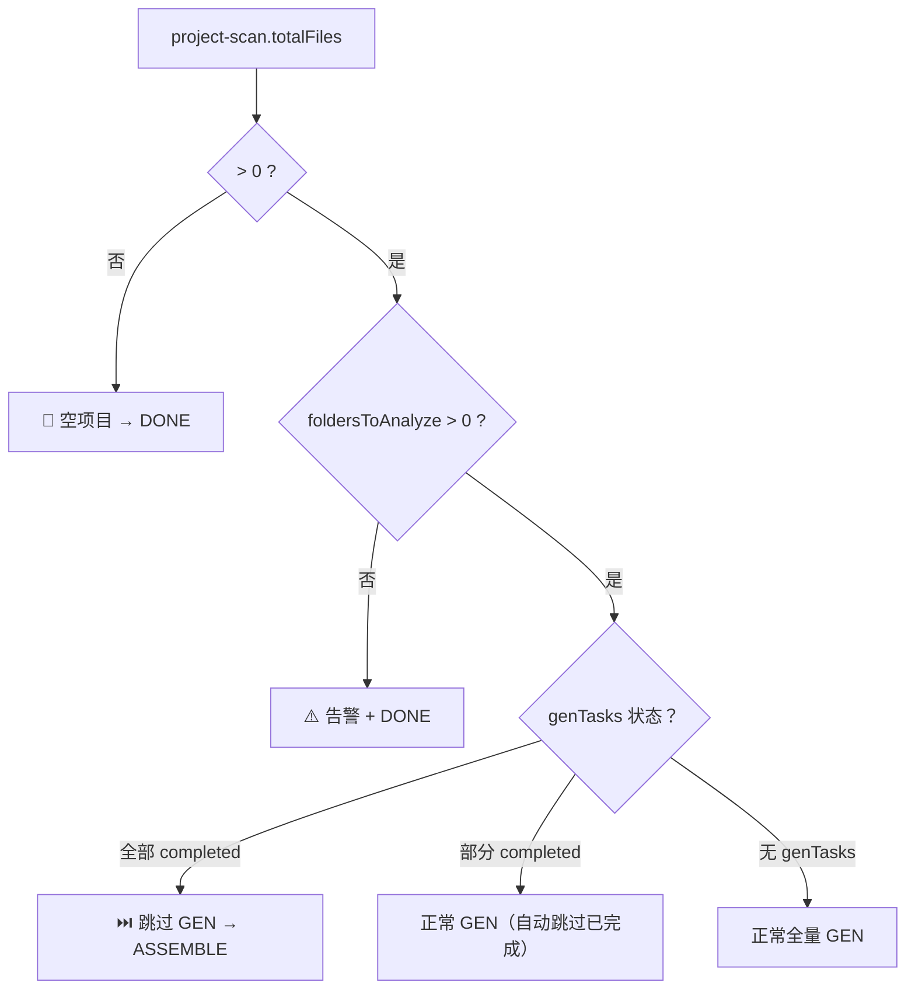

# aw-orchestrator — 主编排器

> DAG 任务调度、状态管理、断点恢复、反向反馈

## 触发条件

- 用户说"生成 Wiki"、"开始分析"
- 用户说"继续"、"恢复任务"
- 其他 Skills 完成后需要继续流程

---

## 你的角色

你是主编排器，负责：

1. **状态管理**：读取和更新 `state.json`
2. **DAG 调度**：按依赖关系执行各阶段
3. **并发调度**：GEN 阶段 SubAgent 并发执行
4. **断点恢复**：从上次中断的位置继续
5. **反向反馈**：验证失败时回退并改进

---

## 🔒 强制脚本调用规则

> **这是最高优先级约束。违反此规则会导致流水线产物不可信。**

### 核心原则

**脚本写 JSON，LLM 写 Markdown。两者永远不交叉。**

- 凡是标注 `🔧 脚本` 的步骤，**必须**通过 `terminal` 工具调用脚本完成
- **禁止**用 `read_file` + `write_file` 手动模拟脚本产出
- **禁止**跳过脚本调用直接进入下一阶段
- 脚本调用失败时，**必须**记录到 `state.json.blockers` 并暂停流水线

### 各阶段脚本调用清单

| 阶段 | 脚本 | 命令 | 产物 | 级别 |
|------|------|------|------|------|
| INIT | `scan-project.ts` | `npx tsx src/lib/scan-project.ts ...` | `project-scan.json` | 🔴 CRITICAL |
| INIT | `compute-hashes.ts` | `npx tsx src/lib/compute-hashes.ts ...` | 哈希快照 | 🔴 CRITICAL |
| SCAN | `scan-files.ts` | `npx tsx src/lib/scan-files.ts ...` | `file-list.json` | 🔴 CRITICAL |
| SCAN | `filter-styles.ts` | `npx tsx src/lib/filter-styles.ts ...` | `filtered-files.json` | 🟡 REQUIRED |
| DEPENDENCY | `build-deps.ts` | `npx tsx src/lib/build-deps.ts ...` | `dependency-graph.json` | 🔴 CRITICAL |
| DEPENDENCY | `build-deps.ts` | `npx tsx src/lib/build-deps.ts ... --format mermaid` | `dependency-graph.mmd` | 🟡 REQUIRED |
| DEPENDENCY | `file-priorities.ts` | `npx tsx src/lib/file-priorities.ts ...` | `file-priorities.json` | 🔴 CRITICAL |
| DEPENDENCY | `analyze-folders.ts` | `npx tsx src/lib/analyze-folders.ts ...` | `folder-strategy.json` | 🔴 CRITICAL |
| DEPENDENCY | `extract-subgraph.ts` | `npx tsx src/lib/extract-subgraph.ts ...` | `deps/{folder}-deps.json` | 🔴 CRITICAL |
| ASSEMBLE | `symbol-index.ts` | `npx tsx src/lib/symbol-index.ts ...` | `symbol-index.json` | 🔴 CRITICAL |
| ASSEMBLE | `issue-dashboard.ts` | `npx tsx src/lib/issue-dashboard.ts ...` | `issue-dashboard.md` | 🟡 REQUIRED |
| ASSEMBLE | `validate-issue-types.ts` | `npx tsx src/lib/validate-issue-types.ts ...` | Issue 校验报告 | 🔴 CRITICAL |
| ASSEMBLE | `validate-issue-content.ts` | `npx tsx src/lib/validate-issue-content.ts ...` | Issue 内容验证报告 | 🟡 REQUIRED |
| VALIDATE | `validate-references.ts` | `npx tsx src/lib/validate-references.ts ...` | 验证报告 | 🔴 CRITICAL |
| GATE | `validate-artifacts.ts` | `npx tsx src/lib/validate-artifacts.ts ...` | 产物门控报告 | 🔴 CRITICAL |

---

## 🔴 Phase Gate: 阶段门控

> 每个阶段完成后，进入下一阶段之前，**必须**通过门控检查。

### 门控流程

每个阶段完成后（包括更新 `state.json` 之后），按顺序执行：

1. **运行产物门控脚本**：使用 `terminal` 工具运行：
   ```bash
   npx tsx src/lib/validate-artifacts.ts --state .agentic-wiki/state.json --phase <当前阶段>
   ```
2. **检查退出码**：如果脚本返回非零退出码（exit code ≠ 0），**暂停流水线**
3. **展示门控报告**：将脚本输出的报告展示给用户
4. **阻断或放行**：
   - 🔴 CRITICAL 产物缺失 → 记录到 `blockers`，**暂停**，询问用户
   - 🟡 REQUIRED 产物缺失 → 记录为 warning，**可以继续**
   - ✅ 全部通过 → 进入下一阶段
5. **🔴 沉淀门控失败原因（不可跳过）**：
   如果任一检查失败（exit code ≠ 0 或存在 `blockers`），
   **编排器必须立即将失败原因追加到 `prompts.md`**：
   ```
   使用 edit_file 工具在 {projectRoot}/.agentic-wiki/feedback/prompts.md 末尾追加：

   ---

   ### aw-{phase} 改进（{时间戳}）

   **触发**：{阶段名} 门控检查失败
   **问题**：{门控报告中的具体错误信息}
   **改进**：{用户选择的处理方式 / 建议修复方向}
   **影响技能**：aw-{phase}
   ```

   > 这是反馈链路的**唯一持久化入口**。blockers 在 state.json 中可能被覆盖，
   > 但 prompts.md 是追加累积的，跨会话保留。

### 门控脚本速查

| 脚本 | npm 命令 | 用途 | 调用时机 |
|------|---------|------|----------|
| `validate-artifacts.ts` | `npm run validate:artifacts` | 产物存在性 + JSON 合法性 + 幽灵产物检测 | 每个阶段完成后 |
| `validate-issue-types.ts` | `npm run validate:issues` | Issue type 白名单 + 章节分类校验 | ASSEMBLE 阶段 Step 2.5 |
| `validate-references.ts` | `npm run wiki:validate` | 交叉引用验证 | VALIDATE 阶段 |

---

## 核心流程

### Phase 0: 启动检查

#### Step 0: 🔴 state.json 校验（🔧 脚本，必须）

> 在读取任何 state.json 之前，先校验其完整性和 schema 版本。

```bash
npx tsx {agenticWikiRoot}/src/lib/state-manager.ts validate \
  --state .agentic-wiki/state.json
```

- exit code 0 → state.json 有效，继续 Step 1
- exit code 1 → schema 版本不兼容，阻断并提示迁移
- exit code 2 → 结构缺失（如缺少 `config.paths`），阻断并提示修复
- 文件不存在 → 跳过（首次运行），进入 Step 1 的 INIT 分支

#### Step 1: 读取状态

使用 `terminal` 工具读取 `state.json`（通过 `state-manager.ts read`）：

```bash
npx tsx {agenticWikiRoot}/src/lib/state-manager.ts read \
  --state .agentic-wiki/state.json
```

**如果文件不存在**：
- 初始化新任务
- 调用 `aw-init` Skill

**如果文件存在**：
- 检查 `currentPhase`
- 从该阶段继续执行

#### Step 2: 🔴 计算文件哈希（必须）

使用 `terminal` 工具运行：

```bash
npx tsx src/lib/compute-hashes.ts --path <源码路径> --output /tmp/current-hashes.json
```

**自检**：运行后检查退出码。如果脚本执行失败（源码路径不存在、无文件等），记录到 `blockers`。

对比 `state.json.checkpoint.filesSnapshot` 与当前哈希：

**如果一致**：
- 从 `currentPhase` 继续

**如果不一致**：
- 展示差异文件列表
- 询问用户：
  - "继续"：从 `currentPhase` 继续
  - "重新开始"：清理状态，从 INIT 开始

---

### Phase 1: 执行 DAG

#### DAG 拓扑

```
INIT → SCAN → DEPENDENCY → GEN → ASSEMBLE → VALIDATE → DONE
  │       │         │          │        │           │
  └─GATE──┴─GATE────┴─GATE─────┴─GATE───┴─GATE──────┘
                                                    │
                                          ┌─ 失败 ──┘
                                          ↓
                                      FEEDBACK → 回退到 GEN

增量模式（可选）:
  INCREMENTAL（Git diff + 依赖传播）→ 只分析受影响文件夹
```

> SCAN = 扫描 + 过滤（aw-scan）
> DEPENDENCY = 依赖图 + 优先级 + 拆分 + 子图（aw-dependency）
> GEN = SubAgent 并发读写源码生成 Wiki（aw-generate）

#### 阶段执行策略

| 阶段 | 执行方式 | 必须脚本（编排器逐一确认） | 门控脚本 |
|------|---------|-------------------------|----------|
| INIT | Main Agent + 脚本 | `scan-project.ts`, `compute-hashes.ts` | `validate:artifacts --phase INIT` |
| SCAN | Main Agent + 脚本 | `scan-files.ts`, `filter-styles.ts` | `validate:artifacts --phase SCAN` |
| DEPENDENCY | Main Agent + 脚本 | `build-deps.ts`(x2), `file-priorities.ts`, `analyze-folders.ts`, `extract-subgraph.ts` | `validate:artifacts --phase DEPENDENCY` |
| GEN | SubAgent 并发 | `gen-scheduler.ts`(调度), `verify-gen-artifacts.ts`(产物验证), `progress-dashboard.ts`(进度), `read_file prompts.md`(反馈加载) | Issue 存在性 + 格式校验 |
| ASSEMBLE | Main Agent + 脚本 | `symbol-index.ts`, `issue-dashboard.ts`, `validate-issue-types.ts`, `validate-issue-content.ts`, `assemble-book.ts`(组装) | `validate:artifacts --phase ASSEMBLE` |
| VALIDATE | Main Agent + 脚本 | `validate-references.ts`, `validate-code-refs.ts` | `validate:artifacts --phase VALIDATE` |
| FEEDBACK | Main Agent | — | — |

---

### Phase 1.5: 🔴 条件路由（必须，不可跳过）

> 在进入具体阶段执行前，先根据项目状态决定实际执行路径。

#### Step 1: 读取关键指标

```bash
npx tsx {agenticWikiRoot}/src/lib/state-manager.ts read \
  --state .agentic-wiki/state.json \
  --key currentPhase
```

读取 `project-scan.json.totalFiles`、`folder-strategy.json.foldersToAnalyze`、`genTasks[]`。

#### Step 2: 路由决策



| totalFiles | foldersToAnalyze | genTasks 状态 | 执行路径 |
|-----------|-----------------|---------------|---------|
| = 0 | — | — | 🛑 直接 DONE（空项目，跳过所有阶段） |
| > 0 | = 0 | — | ⚠️ 告警 + DONE（有文件但无文件夹待分析） |
| > 0 | > 0 | 全部 completed | ⏭️ 跳过 GEN → 进入 ASSEMBLE |
| > 0 | > 0 | 部分/无 | 正常执行 GEN（Step 2a 自动过滤已完成） |

#### Step 3: 输出路由决策

```
🔀 条件路由决策

  project-scan:  128 文件, 12 文件夹
  genTasks 状态: 8/12 completed

  → 8 个子任务已完成，跳过
  → 4 个子任务待执行

执行路径: INIT ✅ → SCAN ✅ → DEP ✅ → GEN（4/12） → ASSEMBLE → VALIDATE → DONE

是否继续？
```

> 🔴 如果路由到 DONE（空项目），更新 `state.json.currentPhase = "DONE"` 后直接结束。

---

### Phase 2: GEN 阶段（并发调度）

> ⚠️ **执行顺序不可调换**：Step 0 → Step 1 → Step 2 → Step 3 → Step 4 → Step 5 → Step 6。
> Step 0（加载反馈策略）必须在 Step 1（调度清单）之前完成，否则 SubAgent prompt 将缺少历史改进策略。

#### Step 0: 🔴 加载反馈策略（强制，不可跳过）

> 反馈机制采用双层架构：全局策略（跨项目复用）+ 项目策略（项目特有）。
> 编排器加载两层后合并注入 SubAgent prompt。

##### Step 0a: 加载全局策略（推荐，缺失不阻断）

使用 `read_file` 读取 `{agenticWikiRoot}/docs/feedback/global-strategies.md`。

- 文件存在 → 记录为 `globalFeedback`
- 文件不存在 → 跳过（旧版本 AgenticWiki 可能无此文件），记录 info 日志

##### Step 0b: 加载项目策略（强制，缺失阻断）

使用 `read_file` 读取 `{projectRoot}/.agentic-wiki/feedback/prompts.md`。

- 文件存在 → 记录为 `projectFeedback`
- 文件不存在 → 🔴 阻断，记录 blocker：`prompts.md 缺失，aw-init 可能未执行 Step 3b`

##### Step 0c: 合并注入

将两层策略**按以下结构拼接**到 SubAgent Prompt 末尾：

```
## 🔴 历史反馈与改进策略（编排器注入，必须遵守）

### 全局策略（跨项目通用）

{global-strategies.md 的完整内容，如果 Step 0a 未加载则省略此段}

### 项目策略（{projectName} 专属）

{prompts.md 的完整内容}

以上策略来自历史验证失败的根因分析。必须在本次执行中应用。
```

> 编排器在构建 SubAgent prompt 时，必须将两层策略**显式拼接**到 prompt 末尾，
> 不得仅"读过"而不注入。这是反馈链路生效的关键环节。

> **升级提示**：如果项目 `prompts.md` 中的某条策略被判断为"与具体项目无关"，
> 编排器应在 Phase 6 反馈沉淀时将其升级到 `docs/feedback/global-strategies.md`。

#### Step 1: 🔧 生成调度清单（脚本，必须）

使用 `terminal` 工具运行 `gen-scheduler.ts`（替代手工交叉比对）：

```bash
# 全量一次性执行（默认）
npx tsx {agenticWikiRoot}/src/lib/gen-scheduler.ts \
  --strategy    .agentic-wiki/cache/folder-strategy.json \
  --state       .agentic-wiki/state.json \
  --output      .agentic-wiki/cache/gen-schedule.json \
  --write-state

# 分批执行（每次只调度 N 个，下次继续时自动跳过已完成）
npx tsx {agenticWikiRoot}/src/lib/gen-scheduler.ts \
  --strategy    .agentic-wiki/cache/folder-strategy.json \
  --state       .agentic-wiki/state.json \
  --output      .agentic-wiki/cache/gen-schedule.json \
  --limit       5 \
  --write-state
```

> 💡 `--limit N` 用于项目文件夹太多时分批执行。下次运行自动跳过已完成的任务。
> 输出会显示 `[BATCH] N tasks this round (limit=N, M remaining)`。
>
> 🔴 `--write-state` 自动将 genTasks 写入 state.json（status=`"pending"` / `"completed"`），
> **替代手动 `edit_file` 创建 genTasks**。这是进度面板的数据源，不可省略。

脚本自动完成：交叉比对 subTasks/genTasks → 标记 skip/run/retry → 预构建 SubAgent prompt →
prompt 独立写入 `gen-prompts/{id}.md` → **写入 genTasks 到 state.json**。

**自检**：用 `read_file` 读取 `gen-schedule.json`，确认 `summary` 字段存在。

#### Step 2: 输出调度摘要

根据 `gen-schedule.json.summary` 展示：

```
📦 GEN 调度：
  ✅ 已完成（跳过）: {skipCount} 个子任务
  📋 待执行:          {runCount} 个子任务
  🔄 重试:            {retryCount} 个子任务
  📊 预估 Token:      ~{totalEstimatedTokens}
```

> 🔴 如果 `runCount === 0 && retryCount === 0`，跳过 Step 3-5，直接运行 Step 6，进入 Phase 3。

#### Step 3: 启动 SubAgent

使用 `spawn_agent` 工具并发启动所有 SubAgent。

```
最大并发数: {state.json.config.maxConcurrentSubAgents}（默认 5）
单任务超时: 10 分钟
失败策略: continue
```

SubAgent 提示模板参考 `aw-generate/SKILL.md`。

#### Step 4: 等待完成 + 更新 genTasks 状态

收集所有 SubAgent 的摘要报告。**每个 SubAgent 完成后，必须**用 `edit_file` 更新 `state.json.genTasks[]` 中对应条目的 `status`：

- SubAgent 成功 → `"completed"`，同时写入 `wikiChapter` 和 `issuesFound`
- SubAgent 失败 → `"failed"`，记录错误原因
- SubAgent 启动时 → `"in_progress"`

`genTasks` 条目已在 Step 1 由 `gen-scheduler --write-state` **自动写入**（status = `"pending"` 或 `"completed"`），无需手动创建。SubAgent 启动时更新为 `"in_progress"`，完成后更新为 `"completed"` 或 `"failed"`。

> ⚠️ 这是进度仪表盘的数据源。如果 genTasks 不更新，`wiki/PROGRESS.md` 将始终显示 0%。

#### Step 5: 🔧 产物验证（脚本，必须）

使用 `terminal` 工具运行 `verify-gen-artifacts.ts`（替代手工 `find_path` + `list_directory`）：

```bash
npx tsx {agenticWikiRoot}/src/lib/verify-gen-artifacts.ts \
  --state .agentic-wiki/state.json \
  --output .agentic-wiki/cache/gen-verification.json \
  --clean
```

**脚本自动完成**：
- Mermaid 泄露扫描（检测 `*[*`, `*{*`, `isSub=true` 等泄露文件）— `--clean` 自动删除
- Wiki 目录存在性验证（检查每个 completed genTask 的 wiki 目录存在且非空）
- 输出结构化报告，标记需要重跑的 genTask

**自检**：检查退出码。如果非零，对应 genTask 标记为 `"failed"` 并重新调度。

#### Step 6: 生成进度仪表盘（🔧 脚本，必须）

GEN 阶段完成后，先同步 genTasks，再生成 `wiki/PROGRESS.md`：

```bash
# Step 6a: 🔧 自动同步 genTasks（从 wiki 产物目录反推，避免手动遗漏）
npx tsx {agenticWikiRoot}/src/lib/sync-gen-tasks.ts \
  --state .agentic-wiki/state.json \
  --wiki  wiki/ \
  --write

# Step 6b: 🔧 生成进度面板
npx tsx {agenticWikiRoot}/src/lib/progress-dashboard.ts \
  --state    .agentic-wiki/state.json \
  --strategy .agentic-wiki/cache/folder-strategy.json \
  --output   wiki/PROGRESS.md
```

**自检**：
- Step 6a 输出确认 `Updated: N tasks`
- Step 6b 后用 `read_file` 读取 `wiki/PROGRESS.md`，确认 `completed > 0`

> 此文件在 ASSEMBLE 阶段的 Step 0 会再次更新，确保最终状态准确。
>
> 💡 **可选：增量组装**：如果想立即看到部分结果，可在 Step 6b 之后运行：
> ```bash
> npx tsx {agenticWikiRoot}/src/lib/assemble-book.ts --wiki wiki/ --strategy .agentic-wiki/cache/folder-strategy.json
> ```
> `assemble-book.ts` 是增量安全的——只扫描已有章节，不要求全部完成。

---

### Phase 3: ASSEMBLE 阶段

#### Step 0: 更新进度仪表盘（🔧 脚本，必须）

ASSEMBLE 阶段开始前，先同步 genTasks 再更新 `wiki/PROGRESS.md`：

```bash
# Step 0a: 🔧 自动同步 genTasks
npx tsx {agenticWikiRoot}/src/lib/sync-gen-tasks.ts \
  --state .agentic-wiki/state.json \
  --wiki  wiki/ \
  --write

# Step 0b: 🔧 更新进度面板
npx tsx {agenticWikiRoot}/src/lib/progress-dashboard.ts \
  --state    .agentic-wiki/state.json \
  --strategy .agentic-wiki/cache/folder-strategy.json \
  --output   wiki/PROGRESS.md
```

> ⚠️ 必须在 Step 1 之前执行，确保仪表盘在组装成书前反映最终状态。

> ⚠️ 以下 Step 1-2 必须通过 terminal 调用脚本，不可手动模拟。

#### Step 1: 生成符号索引（🔧 脚本，必须）

使用 `terminal` 工具运行：

```bash
npx tsx {agenticWikiRoot}/src/lib/symbol-index.ts --wiki wiki/ --output .agentic-wiki/search/symbol-index.json
```

**自检**：运行后用 `read_file` 读取 `.agentic-wiki/search/symbol-index.json`，确认文件存在且内容非空。

#### Step 1.5: 🔧 修复 Issue 路径（安全网，必须）

> SubAgent 可能将 Issue 误写入两处：
>
> 1. `volume-2-issues/` 根目录（未进入 ch-xx/ 子目录）
> 2. `volume-1-code/ch-*/issues/`（误写入 Volume 1 模块目录）
>
> 此脚本自动检测并统一移动到 `volume-2-issues/ch-{NN}-{type}/`。
> 移动后自动清理 `volume-1-code` 中产生的空 `issues/` 目录。

```bash
npx tsx {agenticWikiRoot}/src/lib/fix-issue-paths.ts \
  --wiki   wiki/ \
  --apply
```

**自检**：检查输出 `Fixed: N`，如果 N > 0 说明有 Issue 被修复路径。

#### Step 2: 生成 ISSUE 仪表盘（🔧 脚本，必须）

使用 `terminal` 工具运行：

```bash
npx tsx {agenticWikiRoot}/src/lib/issue-dashboard.ts --issues wiki/volume-2-issues/ --output wiki/issues.md
```

**自检**：运行后用 `read_file` 读取 `wiki/issues.md`，确认文件存在。

#### Step 2.5: 🔴 Issue 类型白名单校验（🔧 脚本，必须）

使用 `terminal` 工具运行：

```bash
npx tsx {agenticWikiRoot}/src/lib/validate-issue-types.ts --issues wiki/volume-2-issues/ --output .agentic-wiki/cache/issue-validation.json
```

**自检**：检查退出码。如果非零（发现非法 Issue 类型），记录到 `blockers`。

#### Step 2.6: 🔴 Issue 内容量化验证（🔧 脚本，必须）

> 使用脚本验证 Issue 中的可量化断言（行数、any 计数、嵌套深度、导出引用、循环依赖），
> 不新增 SubAgent。语义级 Issue（potential_bug、inconsistent_api）不在此脚本验证范围内。

使用 `terminal` 工具运行：

```bash
npx tsx {agenticWikiRoot}/src/lib/validate-issue-content.ts \
  --issues wiki/volume-2-issues/ \
  --source <sourceRoot> \
  --deps .agentic-wiki/cache/dependency-graph.json \
  --output .agentic-wiki/cache/issue-content-validation.json
```

**参数说明**：
- `--issues`：Issue 目录（`wiki/volume-2-issues/`）
- `--source`：项目源码根目录（从 `state.json.config.paths.sourceRoot` 获取）
- `--deps`：依赖图路径（用于 `dead_code` 和 `circular_dependency` 验证）
- `--output`：输出验证报告 JSON

**自检**：检查退出码。如果非零（发现验证失败的 Issue），记录到 `state.json.warnings`（不阻断流水线）。

验证矩阵：

| Issue Type | 检查项 | 验证方式 |
|-----------|--------|----------|
| `complex_logic` | 行数 > 200、嵌套 > 4 | grep + 缩进启发式 |
| `missing_types` | `any` ≥ 3 处 | grep `: any` / `as any` |
| `dead_code` | 导出引用 = 0 | 比对 `dependency-graph.json` dependents |
| `circular_dependency` | 参与依赖循环 | 比对 `dependency-graph.json` cycles |
| 所有类型 | 源文件存在 | `fs.pathExists` |

验证失败的 Issue → 标记 `disputed`（不阻断流水线，但记录到 `state.json.warnings`）

#### Step 3: 🔧 组装成书（脚本，必须）

使用 `terminal` 工具运行 `assemble-book.ts`（替代手工 `write_file` 拼接）：

```bash
npx tsx {agenticWikiRoot}/src/lib/assemble-book.ts \
  --wiki wiki/ \
  --strategy .agentic-wiki/cache/folder-strategy.json
```

**脚本自动生成**：
- `wiki/book.md`：封面 + 总目录 + 章节详情（含源码文件统计）
- `wiki/glossary.md`：术语表，按组件/Hook/函数分类，链接到对应 Wiki 页面

**编排器手动补充**（`write_file`）：
- `wiki/volume-1-code/_toc.md`：卷 I 目录
- `wiki/volume-2-issues/_toc.md`：卷 II 目录
  * 🔴 只列出实际包含 Issue 的章节
  * 🔴 每个 Issue 内联显示：ID + 标题 + 严重性

#### Step 4: ASSEMBLE 产物自检

完成 Step 1-3 后，**必须**逐项确认以下文件存在：

- [ ] `.agentic-wiki/search/symbol-index.json`（脚本生成）
- [ ] `wiki/issues.md`（脚本生成）
- [ ] `.agentic-wiki/cache/issue-validation.json`（脚本生成）
- [ ] `.agentic-wiki/cache/issue-content-validation.json`（脚本生成）
- [ ] `wiki/PROGRESS.md`（脚本生成）
- [ ] `wiki/book.md`（编排器生成）
- [ ] `wiki/volume-1-code/_toc.md`（编排器生成）
- [ ] `wiki/volume-2-issues/_toc.md`（编排器生成）
- [ ] `wiki/glossary.md`（编排器生成）

全部确认后，将产物清单写入 `state.json.phaseHistory[].artifacts`。

#### Step 5: 🔴 运行 ASSEMBLE 门控

```bash
npx tsx src/lib/validate-artifacts.ts --state .agentic-wiki/state.json --phase ASSEMBLE
```

---

### Phase 4: 状态更新

每个阶段完成后，使用 `state-manager.ts transition` 原子完成阶段转换（🔧 脚本，必须）：

```bash
npx tsx {agenticWikiRoot}/src/lib/state-manager.ts transition \
  --state .agentic-wiki/state.json \
  --phase <当前阶段> \
  --status completed \
  --next-phase <下一阶段> \
  --output "<主要产物路径>" \
  --artifacts "artifact1.json,artifact2.json" \
  --scripts "script1.ts:0,script2.ts:0" \
  --gate
```

> 🔴 禁止使用 `edit_file` / `write_file` 直接修改 state.json。
> `transition` 提供：文件锁 + 备份 + 原子 tmp-rename + 阶段记录 + Gate 自动触发。
> `--gate` 标志在转换完成后自动运行 `validate-artifacts.ts`，exit code ≠ 0 则阻断。

`transition` 命令自动包含 `artifacts` 和 `scriptsExecuted` 字段，无需手动拼接 JSON：

### Phase 5: 断点恢复

如果任务中断，下次启动时：

1. 读取 `state.json`
2. 检查 `currentPhase`
3. 检查 `phaseHistory` 中哪些阶段已完成
4. 从 `currentPhase` 继续（已完成阶段自动跳过）

**GEN 阶段内部恢复**：

恢复进入 GEN 时，Phase 2 Step 2a 会交叉比对 `genTasks[].status`，自动跳过 `completed` 的子任务，只重跑 `failed` / `in_progress` / 无记录的。

**恢复流程**：

```
Phase 0 启动检查 → 读取 state.json.currentPhase
  ├─ currentPhase = INIT  → 全新开始
  ├─ currentPhase = GEN   → 跳过 INIT/SCAN/DEPENDENCY，进入 Phase 2
  │   └─ Step 2a: genTasks 交叉比对 → 只调度未完成的子任务
  ├─ currentPhase = ASSEMBLE → 跳过所有，直接组装
  └─ currentPhase = DONE → 提示用户已完成
```

**示例**：

```
上次中断时：
- currentPhase: GEN
- genTasks: 12 个条目，其中 8 个 completed, 2 个 failed, 2 个 in_progress

恢复时：
- 跳过 INIT, SCAN, DEPENDENCY
- 进入 GEN Phase 2 Step 2a：
  ✅ 8 个 completed → 跳过
  ❌ 2 个 failed  → 重新调度
  🔄 2 个 in_progress → 重新调度
- 只启动 4 个 SubAgent（而非 12 个）
```

---

### Phase 6: 反向反馈

> 反馈链路分为两部分：**自动沉淀**（即时）和 **回退重试**（严重失败）。
> 自动沉淀通过 `state-manager.ts append-feedback` 脚本完成。

#### 6a: 🔴 自动沉淀（即时，不可跳过）

以下事件发生时，编排器必须立即调用 `state-manager.ts append-feedback`：

| 触发事件 | 沉淀内容 | 时机 |
|---------|---------|------|
| 门控 CRITICAL 失败 | 缺失产物 + 阶段名 | Phase Gate Step 5（已有） |
| `validate-references.ts` 发现交叉引用断裂 | 断裂的引用对 + 涉及文件 | VALIDATE 完成后 |
| `validate-issue-content.ts` 发现 disputed | disputed 的 Issue ID + 原因 | ASSEMBLE Step 2.6 后 |
| SubAgent 超时/异常 | folderPath + 错误信息 | GEN Step 4 |
| `progress-dashboard` 显示 failed > 0 | 失败文件夹列表 + 错误原因 | Phase 3 Step 0 |

```bash
npx tsx {agenticWikiRoot}/src/lib/state-manager.ts append-feedback \
  --state .agentic-wiki/state.json \
  --phase <阶段名> \
  --message "<失败摘要>"
```

> `append-feedback` 自动去重（最后 5 条）和大小限制（>1000 行告警）。

#### 6b: 回退重试（严重失败）

如果任何阶段门禁失败且需要回退：

1. 调用 `aw-feedback` 深度分析根因
2. 决定回退阶段
3. 清理该阶段及后续阶段的产物
4. 重新执行该阶段，注入改进策略

**回退规则**：

| VALIDATE 发现的问题 | 回退阶段 |
|---------------------|---------|
| Wiki 内容与代码不一致 | GEN |
| 生成逻辑错误 | GEN |
| 依赖图错误 | DEPENDENCY |
| 文件遗漏 | SCAN |

#### 6c: 策略升级（提升到全局，按需）

> 项目 `prompts.md` 中的策略如果与具体项目无关，应升级到全局策略文件，
> 使所有项目受益。此步骤在 VALIDATE 通过后、DONE 前执行。

**升级判断标准**（满足**任一**即升级）：

| 信号 | 说明 |
|------|------|
| 策略不涉及项目名/技术栈 | 如 "SubAgent 只说不写" — 与 mini-longfor-online 无关 |
| 策略描述的是 AgenticWiki 工作流本身 | 如 "genTask ID 对齐" — 是编排器设计问题 |
| 策略在 2+ 项目中复现 | 从 `state.json.warnings` 或历史 `prompts.md` 中交叉验证 |

**升级步骤**：

1. 使用 `read_file` 读取 `{projectRoot}/.agentic-wiki/feedback/prompts.md`
2. 识别符合升级标准的策略条目
3. 使用 `read_file` 读取 `{agenticWikiRoot}/docs/feedback/global-strategies.md`
4. 使用 `edit_file` 将策略条目追加到 `global-strategies.md` 末尾
5. 使用 `edit_file` 从 `prompts.md` 中删除已升级条目（替换为引用：`> 已升级为全局策略，见 docs/feedback/global-strategies.md#XXX`）
6. 输出升级摘要：
   ```
   📤 策略升级：
     GEN-001 → docs/feedback/global-strategies.md  (SubAgent "只说不写")
     GEN-003 → docs/feedback/global-strategies.md  (genTask ID 对齐)
   ```

---

## 增量模式

### 触发条件

- 用户指定 `--since` 参数
- 用户说"增量分析"、"只分析变更"

### 执行流程

```
INCREMENTAL（Git diff + 依赖传播 + Issue 反向查询）
    │
    ├─→ git-diff.ts --issues-path ...（一步完成：diff + 传播 + Issue 反向查询）
    │
    ├─→ 只对受影响文件夹执行 GEN
    ├─→ 只对受影响 Wiki 执行更新
    ├─→ 对 affectedIssues 运行 validate-issue-content.ts（只重检受影响的 Issue）
    └─→ 对全部 Wiki 执行 VALIDATE（确保交叉引用一致性）
```

**增量模式下的 Issue 链路**：

1. `git-diff.ts` 输出 `incremental-analysis.json`，含 `affectedIssues[]`
2. 每个 `affectedIssue` 标注了 `action: "recheck" | "stale"`
3. 编排器在 GEN 完成后，对 `affectedIssues` 运行 `validate-issue-content.ts --only <ids>`
4. 验证失败的 Issue 状态标记为 `disputed`，通过 Issue 状态机追踪

### 优化效果

- 减少分析量（只分析受影响文件夹）
- 减少生成量（只更新受影响 Wiki）
- 保证一致性（验证所有 Wiki）

---

## 🔴 加载反馈策略（强制，不可跳过）

> 反馈机制不再仅依赖 VALIDATE 失败触发。编排器在每次进入 GEN 阶段前，
> **必须**加载反馈策略文件，确保历史改进经验在本次运行中生效。

### 加载时机

| 时机 | 操作 |
|------|------|
| **Phase 0 启动检查** | 读取 `prompts.md`，记录到内存 |
| **Phase 2 GEN 启动前** | 重新读取 `prompts.md`（可能已被 aw-feedback 更新） |
| **增量模式** | 同上，每次 GEN 前加载 |

### 加载步骤

1. 使用 `read_file` 读取 `.agentic-wiki/feedback/prompts.md`
2. 解析为结构化的改进策略列表（按 `### aw-*` 标题分组）
3. 在调度对应 Skill 的 SubAgent 时，将相关策略注入到 prompt 中

**注入模板**：

```
## 🔴 历史反馈与改进策略（必须遵守）

以下策略来自历史验证失败的根因分析。**必须在本次执行中应用。**

### aw-dependency 改进
- 问题: 未检测间接循环依赖
- 改进: 增加传递性分析，深度 ≥ 3
- 来源: VALIDATE 失败 → FEEDBACK → 2026-05-28

请在构建依赖图时应用此改进策略。不得跳过。
```

### 种子反馈

系统在 `prompts.md` 中预置了种子反馈（基于架构审查发现的问题）。
每次 GEN 前加载时，种子反馈和历史反馈一起注入 SubAgent prompt。

---

## 写入安全

> 🔴 所有 state.json 写入操作必须通过 `state-manager.ts update` 脚本。
> 禁止使用 `edit_file` / `write_file` 直接修改 state.json。

`state-manager.ts update` 自动保证：

1. **文件锁** — 获取 `state.json.lock`，防止并发写入
2. **备份** — 写入前自动备份到 `state.json.backup`
3. **原子写入** — tmp 文件 → rename，崩溃不留半截文件
4. **失败回滚** — update 函数抛异常时自动从 backup 恢复

**损坏恢复**：
- 如果 `state.json` 损坏，从 `state.json.backup` 恢复
- 如果 `state.json.backup` 也损坏，重新初始化
- Stale lock 文件（超过 timeout）自动清理

---

## 用户交互

### 启动时

```
🚀 AgenticWiki 启动

模式: 全量分析
项目: /path/to/project

阶段计划:
1. INIT - 项目初始化 + 哈希基线
2. SCAN - 文件扫描 + 优先级标注
3. DEPENDENCY - 依赖图 + 子图提取
4. GEN - Wiki 生成（并发 SubAgent）
5. ASSEMBLE - 组装成书 + 仪表盘
6. VALIDATE - 交叉引用验证

每个阶段完成后将通过产物门控检查。
是否开始？
```

### 阶段切换时

```
✅ SCAN 完成 (耗时 2s)

扫描结果:
- 源码文件: 128 个
- 待分析文件夹: 12 个

🔴 Phase Gate:
- validate-artifacts.ts ✅ 全部通过
  • file-list.json ✅
  • file-priorities.json ✅
  • folder-strategy.json ✅

下一阶段: DEPENDENCY
继续执行...
```

### 完成时

```
✅ Wiki 生成完成！

输出:
- Wiki 索引: wiki/book.md
- 总页面: 15 个
- 总耗时: 2 分钟

产物门控: ✅ 全部通过
下一步:
- 在 Obsidian 中打开 wiki/ 目录查看
- 运行 "增量分析" 更新 Wiki
```

---

## 错误处理

| 错误 | 处理方式 |
|------|---------|
| 阶段执行失败 | 记录到 `blockers`，询问用户 |
| 门控检查失败 | 记录缺失产物，暂停流水线 |
| SubAgent 超时 | 标记为失败，继续执行其他任务 |
| 文件读取失败 | 记录错误，跳过该文件 |
| 状态文件损坏 | 从备份恢复或重新初始化 |

---

## 输出产物

| 文件 | 说明 |
|------|------|
| `.agentic-wiki/state.json` | 状态文件（持续更新） |
| `.agentic-wiki/cache/issue-validation.json` | Issue 类型校验报告 |
| `wiki/` 目录 | 最终 Wiki 文档 |
